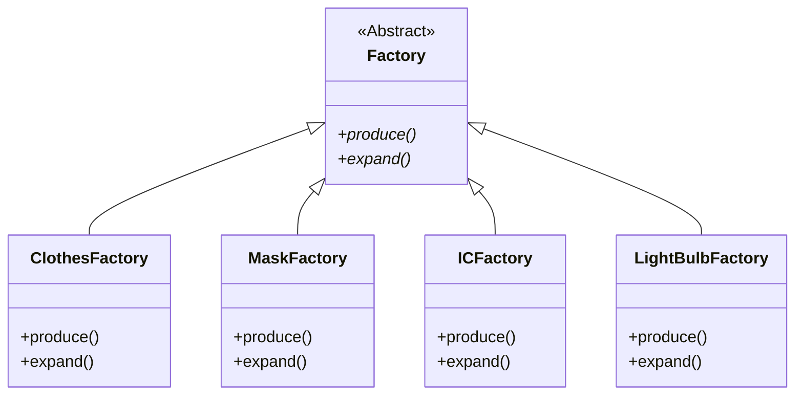
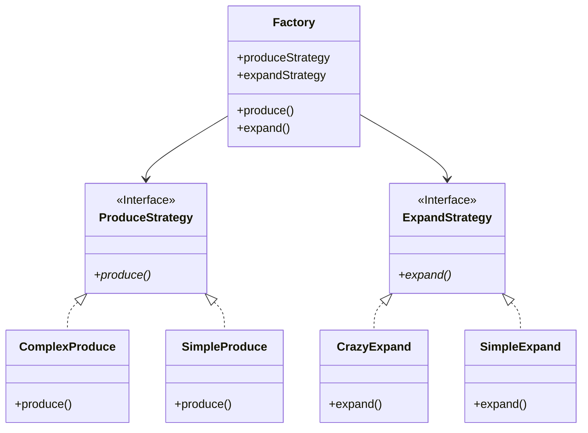

### [Refactoring Guru](https://refactoring.guru/design-patterns/strategy)

# 範例

假設今天有一個 abstract superclass: `Factory`，有多種不同的 factories 繼承並實作它，且這些 factories 各自實作自己的 `produce()` 與 `expand()` methods：



如果 `ClothesFactory` 與 `MaskFactory` 的 `produce()` 內容一模一樣，`ICFactory` 與 `LightBulbFactory` 的 `produce()` 一模一樣，`MaskFactory` 與 `LightBulbFactory` 的 `expand()` 一模一樣，`ClothesFactory` 與 `ICFactory` 的 `expand()` 一模一樣，你就會發現有很多重複的 code 出現在各個 factories 間。

### 使用 Strategy Pattern 解決

Produce 的策略有若干種，expand 的策略也有若干種，但有可能不同的 factories 使用的是同一種 produce 策略或同一種 expand 策略，所以應該在 factory 外面先定義好所有 produce 策略，將這些策略歸類為 `ProduceStrategy`（expand 策略也比照辦理），然後各種 factories 再自己決定要選用哪種策略：



讓我們看看現在 `Factory` class 大概的樣子：

```TypeScript
class Factory {
    protected expandStrategy: ExpandStrategy;
    protected produceStrategy: ProduceStrategy;
    public constructor(es: ExpandStrategy, ps: ProduceStrategy) {
        this.expandStrategy = es;
        this.produceStrategy = ps;
    }
    protected expand(): void {
        this.expandStrategy.expand();
    }
    protected produce(): number {
        return this.produceStrategy.produce();
    }
}
```

如此一來，你可以先建立一個 `CrazyExpand` instance，再建立一個 `SimpleProduce` instance，然後將它們透過 [Dependency Injection](</Programming Language/Dependency Injection.md>) 的方式傳入 `Factory` 的 constructor 來建立一個 `Factory` instance：

```TypeScript
const icFactory = new Factory(new CrazyExpand(), new SimpleProduce());
```
