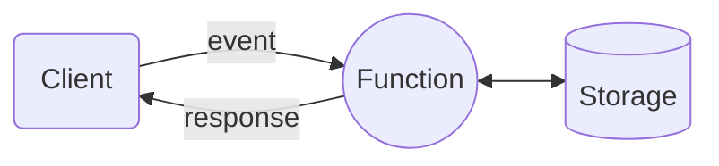

Serverless 不是字面上沒有 server 的意思，沒有什麼服務是不需要 server 就可以運作的，這個詞在這裡真正的意思是：

>開發者無法直接存取與管理運行服務所用的 server 的 infrastructure。

開發者不用處理 server 的 initialize、configure、deploy、scale、maintain，這些事情雲端服務供應商會幫你處理好。

三大雲端服務供應商都有提供 serverless computing 的服務：

- AWS Lambda
- Azure Functions
- Google Cloud Functions

這些服務被歸類為 **FaaS (function as a service)**，它們都有一個共同點：server 只會在使用者呼叫 funcitons 時才動起來。

---

---

### 優點

- Auto scale
    - 服務收費取決於 function 使用的 CPU time（通常以 ms 為單位），不用預繳固定費用
    - 可以應付大流量
- 開發者可以專注於開發，不用處理 server

### 缺點

- 處理一個 request 的時間不能太久（以 AWS Lambda 為例是 15 分鐘），所以不適合用來做 deep learning 這類長時間的工作
- 若太久沒 call function，則下一次 call function 時須要多等一段 server wake-up 的時間
- 不能存取 file system（檔案須存在其它服務上，如 AWS S3）

# 比較

如果把開發者須花在處理 server 的時間由高到低排序，依序會是：

[Bare-Metal Server](https://en.wikipedia.org/wiki/Bare-metal_server) > Virtual Machine > Container > Serverless

---

### Serverless vs. Monolithic

![[serverless-to-monolithic.jpeg]]

# 參考資料

- <https://www.youtube.com/watch?v=Fx3ZGy-mbV4>
- <https://www.youtube.com/watch?v=YoBfFwsoWIU>
- <https://www.youtube.com/watch?v=vxJobGtqKVM>
- <https://www.youtube.com/watch?v=JTp0TY_2hXM>
- <https://www.ibm.com/topics/serverless>
