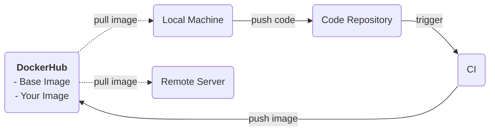

# 學習資源

- [📃 官方文件](https://docs.docker.com/guides/)
- YouTube
    - <https://www.youtube.com/watch?v=pg19Z8LL06w>
    - <https://www.youtube.com/watch?v=3c-iBn73dDE>
- https://www.huweihuang.com/docker-notes/

# Containerization

Containerization（容器化）指的是「將應用程式運行時所需的 OS、runtime、code、dependencies 打包」的動作，目的是讓應用程式可以快速地在各式各樣的機器上被建置並開始運行。

### 容器化的優點

- 可以快速建置環境，有利於拉近 **dev**elopment 與 **op**eration 兩種工作間的距離（簡化了 operation 的工作）。
- 可以將多個不同的應用程式分別容器化並運行在同一台 host 上，這些應用程式的環境相互獨立，不會影響彼此。

### Workflow with Docker



# Container vs. Virtual Machine


Virtual machine (VM) 會將整個 OS 都虛擬化，所以不同 VMs 間只會共用 host 的硬體資源；相對地，一個 host 上所有 containers 不只共用 host 的硬體資源，也共用 host 的 [OS kernel](</Operating System/Kernel.draft.md>)，所以即使 container 內可以有自己的 OS，但那也只包含 application layer 的 OS，這樣的好處是可以讓 container 變得相對輕量，也縮短了啟動 container 所需的時間（分鐘級 → 毫秒級）。

你可能會問：「如果使用 host 的 OS kernel，那要怎麼在一個 Windows 或 macOS 的電腦上運行 Linux 的 container？」答案是須要先建立一個 VM 把 OS kernel 也虛擬化，比如若要在 macOS 裡運行一個 Linux container，就要先在 macOS 裡架一個有基本 Linux 環境的 VM，然後才能在 VM 裡面運行 container。

幸運的是，架設 VM 這件事已經有 [#Docker Desktop](</./Tools/Docker/1 - Introduction.md#Docker Desktop>) 這類的工具幫我們自動處理好了！

# The Architecture of Docker

Docker 是一個提供 containerization 服務的平台，整個 Docker 平台主要可以分為 **client**、**Docker host** 與 **registry** 三個 components，使用者透過 client 操控 Docker host；Docker host 必要時會到 registry 下載 image。


### Client

使用者可以透過 [Docker CLI](</Tools/Docker/2 - Docker CLI.md>)（程式名稱為 `docker`）或 REST API 與 Docker host 溝通。

以「列出在 local 運行中的 containers」為例：

- Docker CLI

    ```bash
    docker ps
    ```

- REST API

    ```plaintext
    curl --unix-socket /var/run/docker.sock http://localhost/containers/json
    ```

    這個指令透過 [Unix domain socket](</Network/Socket & Port.md#Unix Domain Socket>) 與 Docker host 溝通。

### Docker Host

Docker host 包括 Docker daemon，以及存放 images 與 containers 的空間。

Docker daemon 是 Docker 的核心程式（程式名為 `dockerd`）。我們可以粗略地說：「Docker daemon 負責管理 images、containers、Docker networks 與 Docker volumes」，但其實 ==`dockerd` 本身不負責運行 container==，它會把有關 container management 的工作轉交給更底層的程式（程式名為 `containerd`）來完成。

>[!Info]
>關於 Docker daemon 的完整介紹請看[這篇](</Tools/Docker/6 - Docker Daemon.draft.md>)。

### Registry

- Registry 指的是用來存放 images 的地方，通常特指雲端的空間。
- Registry 分為 [public (Docker Hub)](</Tools/Docker/4 - Docker Hub.draft.md>) 與 private (self-hosted) 兩種。
- 使用者可以把 local 的 images 推上 registry，也可以從 registry 中 pull images 到 local。
- Image 之於 Docker Hub 猶如 project 之於 GitHub。

### Docker Engine

Client 與 Docker host 會被包成一個叫 Docker engine 的應用程式。

# Docker Desktop

[Docker Desktop](https://www.docker.com/products/docker-desktop/) 將 Docker engine、Docker CLI 與 Docker Compose、Kubernetes 等工具整合，有 GUI，且必要時會建立一個 virtual machine，讓開發者可以運行不同 OS 的 container，所以通常在 Windows 或 MacOS 系統中都會裝 Docker Desktop，不會單純裝 Docker engine。

# Dockerfile, Image & Container

### Dockerfile

- 開發者透過撰寫 Dockerfile 來設定要建置什麼樣的環境。
- Docker engine 根據 Dockerfile 來堆疊出 image，最後再根據 image 建置 container 並運行。

### Image

- Image 又叫做 container image，就像是一個應用程式環境的 snapshot，這個 snapshot 記錄了 OS layer、filesystem 的狀態、環境變數... 等。
- Image 由若干個 layers 堆疊而成，每一個 layer 都是在對 filesystem 做修改。

### Container

- Container 是一個根據 image 建立 (create) 出來的環境，開發者可以對它進行 "start"、"stop"、"delete" 等操作。
- 一個 host 上可以運行多個 containers，containers 之間互不干擾，但開發者也可以建立一個 network 讓多個 containers 可以互相溝通。


>[!Info]
>完整介紹請看[這篇](</Tools/Docker/3 - Dockerfile, Image & Container.md>)。

# Multi-Container Application

[一個完整的應用程式／服務／系統](</System Design/Backend Web Architecture.md>)通常會包括 API server、database、reverse-proxy server 等多個系統元件，其中一種做法是只建立一個 container 然後把所有東西都放在裡面，但這樣做的話會有一些缺點：

- 無法針對單一系統元件進行 scaling，只能整個應用程式一起。
- 無法針對單一系統元件的 image 進行 rebuild。
- 可能要處理 dependencies 不相容的問題。

因此，比較好的做法是將不同統元件拆成不同的 containers，比如一個專門運行 API server 的 container、一個 database 專用的 container、一個 reverse-proxy server 專用的 container 等，然後再用 **Docker Compose** 或 **Kubernetes** 這類 orchestration tool 來管理這些 containers。

### Docker Compose

A tool for defining and running multi-container applications ==on a single host==.

須注意的是，由於 Docker Compose 是在單一 host 上運行所有 containers，所以仍然沒有解決「無法針對單一系統元件進行 scaling」的問題。

>[!Info]
>關於 Docker Compose 的詳細介紹請看[這篇](</Tools/Docker/5 - Docker Compose.draft.md>)。

### Kubernetes

Manage containers deployed ==across multiple nodes (hosts)==.

# OCI

- OCI 是 [Open Container Initiative](https://opencontainers.org/) 這個組織的縮寫。
- OCI 致力於打造 open-source 的容器化開發生態。
- OCI 也致力於制定容器化開發的通用標準，目前已經有關於 container runtime 的規格書以及 container image 的規格書。

# 其它

- Docker 的核心程式使用 Go 寫的。
- Docker 之所以可以讓 containers 間互相獨立，主要是透過「為每個 container 建立專屬的 namespaces」來做到。

# 參考資料

- <https://docs.docker.com/get-started/docker-overview/>
- <https://www.docker.com/resources/what-container/>
- <https://accenture.github.io/blog/2021/03/18/docker-components-and-oci.html>
- [五分鐘搞懂 Docker](https://www.youtube.com/watch?v=J0NuOlA2xDc)
