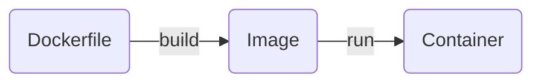

# Image

Image 又叫做 container image，就像是一個應用程式環境的 snapshot，這個 snapshot 記錄了某個時刻下 filesystem 的狀態，用來建立一個具有該環境的 container。==Image is readonly/immutable==，建立後不能修改內容。

### Layering

Image 由若干個 layers 構成，每執行 Dockerfile 中的一個指令就會建立出一個 layer 覆蓋在既有的 layers 之上，每一個 layer 都是在對 filesystem 做修改。雖然 "image is immutable"，但我們可以透過在一層 image 上疊加另一層 image 來覆寫原本 image 的行為。

**Example**

以一個 Python API server image 為例，通常會有以下幾個 layers：

1. 在第一個 layer 下載並更新 apt（Linux Ubuntu 用的套件管理工具）
2. 在第二個 layer 透過 apt 下載 Python 與 pip（Python 用的套件管理工具）
3. 在第三個 layer 複製 requirements.txt 到 filesystem 內。
4. 在第四個 layer 透過 pip 下載所有 requirements.txt 中列舉的 Python dependencies。
5. 在最後一個 layer 複製所有 application code 到 filesystem 內。

==Layering 的好處在於 reusability==，承上方的例子，假如今天有第二個應用程式也要使用 Python，那它可以直接使用已安裝好 Python 的 image 作為基底（上方例子中的第二層），不須要自己 build 一個。

### Two Ways to Build Images

- 使用 `docker container commit`（較少見）

    先使用 base image 建立 container，然後在 container 的 Shell 輸入指令來建立環境，完成後離開 container，然後在 host 上輸入：

     ```bash
     docker container commit -m "{MESSAGE}" {CONTAINER_ID} {NEW_IMAGE_NAME}[:{TAG}]
     ```

    關於 `docker container commit` 指令的詳細使用方式，請見[官方文件](https://docs.docker.com/reference/cli/docker/container/commit/)。

- 使用 Dockerfile + `docker build`

    Dockerfile 請看[[#Dockerfile|這段]]。

### Tagging

Image 除了有名稱外，開發者還可以為它加上 tag，tag 通常被用來表示 image 的版本。

`docker build` 時，可以用 `--tag [{HOST}[:{PORT_NUMBER}]/]{PATH}[:{TAG}]` 為 image 取名字與 tag；若是已經 build 好的 image，則可以用 `docker image tag` 來增加 tag 到指定的 image 上。

### Pull & Push Images

除了自己 build image 以外，也可以從公有或私有的 remote repository（如 [[4 - Docker Hub.draft|Docker Hub]]）pull image 來使用，也可以將自己建立好的 image push 至 repository，相關指令請看[[2 - Docker CLI#與 Registry 相關的指令|這篇]]。

### Caching

Build image 時，Docker daemon 除了會產出最終的 image layer 外，也會將中間每一個 layer 都 cache 起來，目的是未來 rebuild 時可以重複使用，進而有效縮短 build image 的時間；pull/push image 時，相同的 layer 也不會被重 pull/push。

在 rebuild image 時，除了以下兩種情況外，Docker daemon 都會使用 cache：

- `RUN` instruction 所執行的 command 有變
- `COPY` 或 `ADD` 的 source file 的內容或 property（比如 permission）有變

當某個 Dockerfile instruction 出現上述任一種情況時，Docker daemon 會 rebuild 該 layer 並 invalidate 原本的 cache，且該 layer 之後的每一個 layer 都必須 rebuild。

若 `docker build` 時想要強制 rebuild、不使用 cache，須加上 `--no-cache` option。

# Dockerfile

使用 `docker container commit` 的方式建立 image 雖然直覺，但其實有許多不方便處，比如當 image 被刪除後，開發者便無法快速地 rebuild 出一個一模一樣的；或者當開發者想要更改 image 中的 layer 順序或在中間插入／刪除某個 layer 時，都必須從頭到尾重新 commit 一次。

Dockerfile 讓開發者可以將 layer order 按順序以文件的方式紀錄，當要 rebuild image 時，只須更改 Dockerfile 然後使用 `docker build` 指令即可快速且自動化完成所有 building processes。

**Example**

```Dockerfile
FROM python:3.12
WORKDIR /usr/local/app

COPY requirements.txt ./
RUN pip install --no-cache-dir -r requirements.txt

COPY src ./src
EXPOSE 5000

RUN useradd app
USER app

CMD ["uvicorn", "app.main:app", "--host", "0.0.0.0", "--port", "8080"]
```

### Dockerfile Instructions

>[!Note]
>詳細撰寫規則請見[官方文件](https://docs.docker.com/reference/dockerfile/)，這裡只節錄常用的。

##### `FROM`

```Dockerfile
FROM [--platform={PLATFORM}] {IMAGE_NAME}[:{TAG}] [AS {NAME}]
```

- `--platform` argument 表示要使用專門 build 給哪個 OS & ISA 用的 image，預設為 host 本身的 OS & ISA
- `{BASE_IMAGE_NAME}[:{TAG}]` 表示要使用哪個 image 作為這個新 image 的 base，若沒有提供 `{TAG}` 則預設使用 `latest`。

##### `WORKDIR`

```Dockerfile
WORKDIR {PATH}
```

切換至 image 中指定的位置，若該路徑不存在，則會先將缺的目錄建立出來再進去。

##### `COPY`

```Dockerfile
COPY {PATH_ON_HOST}:{PATH_IN_CONTAINER}
```

- 將 host filesystem 中的檔案複製到 image 內的 filesystem 中。
- 邏輯與 Linux 的 `cp` 指令相同。
- 也可以用來複製不同 build stages 間的 image（詳見 [[#Multi-Stage Builds]]）。

##### `RUN`

```Dockerfile
RUN {COMMAND}
```

執行指令。

##### `ENV`

設定 container 運行時的環境變數。

有兩種寫法：

```Dockerfile
ENV {NAME}={VALUE} [...]
```

- 上面這種寫法須注意 `=` 的左右兩邊不能有空格。
- 可以用一個 instruction 設定多個環境變數

```Dockerfile
ENV {NAME} {VALUE}
```

- 上面這種寫法不須要 `=`，但一個 instruction 只能設定一個環境變數，若有多個環境變數，須用多個 `ENV` instructions 來設定。

##### `EXPOSE`

```Dockerfile
EXPOSE {PROT}
```

告訴使用者這個 image 希望將哪個 port 對外，當使用 `docker run --publish-all` 時，會 publish 所有 exposed ports。

##### `USER`

```Dockerfile
USER {USERNAME}
```

- 設定要用哪個 user 來執行後續 `RUN` 的指令。
- 如果要自訂 user，記得先用 `RUN useradd [{OPTIONS}] {USERNAME}` 這類的指令新增 user。

##### `CMD`

```Dockerfile
CMD [{COMMAND}, {ARGUMENT}, ...]
```

- 使用這個 image 建立的 container 啟動時，預設會執行的指令。
- 須依照指令中的空格位置，改成以 `,` 分隔的方式放在 `[]` 中，比如 `CMD ["python", "-m", "http.server"]`。

### 註解

```Dockerfile
# this is comment
```

Dockerfile 中的註解不能寫在跟 instruction 同一行的最後面：

```Dockerfile
RUN echo hello  # this will not be considered as comment
```

### Instruction 的順序很重要

在前面的 [[#Caching|image caching]] 有提到：一旦某個 instruction 使得 cache 無法使用後，後續所有 layer 都只能 rebuild，所以撰寫 Dockerfile 時有以下兩個基本技巧：

- 內容==越常==被改動的檔案應該盡可能==越晚==被 `COPY` 進 image。
- 不會影響到 image 行為的檔案應該避免被 `COPY` 進 image。

**錯誤示範**

```Dockerfile
FROM node:20-alpine
WORKDIR /app
COPY . .
RUN yarn install --production
EXPOSE 3000
CMD ["node", "./src/index.js"]
```

上面這種寫法，當改動到任何程式碼時，都會從 `COPY . .` 開始 rebuild，就會須要花很多時間重新進行 `yarn install`，即使要安裝的套件根本沒有變。

**修正後**

```Dockerfile
FROM node:20-alpine
WORKDIR /app
COPY package.json yarn.lock ./
RUN yarn install --production 
COPY . . 
EXPOSE 3000
CMD ["node", "src/index.js"]
```

修正後的寫法，若有改動程式碼，但沒有更動到 package.json 與 yarn.lock，就可以利用 cache 來避免重複執行 `yarn install`。

### Multi-Stage Builds

==Multi-stage builds 的目的是縮小 final image 的大小==，在建置 image 時，中間準備階段所安裝的套件、生成的檔案可能是 final image 用不到的，開發者可以將這些事情寫在某個 intermediate stage 中，final image 只從 intermediate stage 複製出必要的檔案即可。

比如對於用 compile language 打造的服務來說，final image 只需要最終的 compiled binaries，不須要 source code、compiler，此時就可以將 compiling 的過程寫在 intermediate stage 中。

- 當一個 Dockerfile 中有多個 `FROM` instructions 時，每個 `FROM` 就是一個 stage。
- Stages 間可以繼承，比如 `FROM a AS b` 的意思就是「以 stage "a" 的 image 作為基底，建立一個新的 image，並且將新的 stage 命名為 "b"」
- Stages 間的檔案可以 `COPY`，須使用 `--from={STAGE}` 參數來指定，比如 `COPY --from=a /app/requirementx.txt /app/`。
- Build image 時，可以透過 `--target {STAGE}` 參數來指定最後要輸出哪個 stage 的結果。

# Container

Container 是一個根據 image 建立 (create) 出來的環境，一個 host 上可以運行多個 containers，不同的 containers 有獨立的 filesystem，所以不會互不干擾；在 container 內對 filesystem 操作時也不會影響到 image 的內容。

Dockerfile 中的最後也可以寫 container 建立後要執行的指令。

### Container Status

![[docker-container-fsm.png]]

- 圖中的 "stopped" 也可以叫做 "exited"；"running" 也可以叫做 "up"

# 參考資料

- <https://docs.docker.com/reference/dockerfile/>
- <https://docs.docker.com/build/building/multi-stage/>
