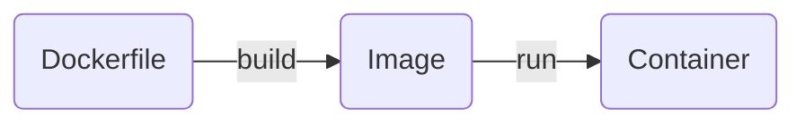

# Image

Image 又叫做 container image，就像是一個應用程式環境的 snapshot，這個 snapshot 記錄了 OS layer、filesystem 的狀態、環境變數... 等，用來建立一個具有該環境的 container。

### Layering

Image 由若干個 layers 堆疊而成，每一個 layer 都是在對 filesystem 做修改。

==Image is readonly/immutable==，建立後不能修改內容，但我們可以透過在既有的 image 上疊加新的 layers 來覆寫原本 image 的行為。疊加新 layers 後的 image 就是一個新的 image，製造一個新 image 的動作稱為 "build"。

**Example**

以一個 Python API server image 為例，通常會有以下幾個 layers：

1. 在第一個 layer 下載並更新 apt（Linux Ubuntu 用的套件管理工具）
2. 在第二個 layer 透過 apt 下載 Python 與 pip（Python 用的套件管理工具）
3. 在第三個 layer 複製 requirements.txt 到 filesystem 內。
4. 在第四個 layer 透過 pip 下載所有 requirements.txt 中列舉的 Python dependencies。
5. 在最後一個 layer 複製所有 application code 到 filesystem 內。

Layering 的好處在於 reusability，承上方的例子，假如今天有第二個應用程式也要使用 Python，那它可以直接使用已安裝好 Python 的 image 作為基底（上方例子中的第二層），不須要自己從頭 build 一個。

##### 兩種 Build Image 的方法

- 使用 `docker container commit`（較少見）

    先使用 base image 建立 container，然後在 container 的 Shell 輸入指令來建立環境，完成後離開 container，然後在 host 上輸入：

     ```bash
     docker container commit -m "{MESSAGE}" {CONTAINER_ID} {NEW_IMAGE_NAME}[:{TAG}]
     ```

    關於 `docker container commit` 指令的詳細使用方式，請見[官方文件](https://docs.docker.com/reference/cli/docker/container/commit/)。

- 使用 Dockerfile + `docker build`

    Dockerfile 請看[[#Dockerfile|這段]]；`docker build` 指令的使用方式請看[[2 - Docker CLI#根據 Dockerfile 建立 Image|這篇]]。

### Tagging

- Image 除了有名稱外，還有 tag，tag 通常被用來表示 image 的版本。
- `docker build` 時，可以用 `--tag [{HOST}[:{PORT_NUMBER}]/]{PATH}[:{TAG}]` 為 image 取名字與 tag：
    - 若 tag 名稱已被標記在另外一個 image 上了，則該 tag 會從舊 image 上被移除。
    - 若沒有提供 tag，則預設的 tag 為 `latest`。
- 可以用 `docker image tag` 在既有的 image 上增加 tag。
- 若一個 image 沒有任何 tag，且在 host 上沒有被用來運行任何 container，則該 image 會被標記為 "dangling image"。

### Caching

Build image 時，Docker daemon 除了會產出最終的 image layer 外，也會將中間每一個 layer 都 cache 起來，目的是未來 rebuild 時可以重複使用，進而有效縮短 build image 的時間；pull/push image 時，相同的 layer 也不會被重 pull/push。

在 rebuild image 時，除了以下兩種情況外，Docker daemon 都會使用 cache：

- `RUN` instruction 所執行的 command 有變
- `COPY` 或 `ADD` 的 source file 的內容或 property（比如 permission）有變

當某個 Dockerfile instruction 出現上述任一種情況時，Docker daemon 會 rebuild 該 layer 並 invalidate 原本的 cache，且==發生變動的 layer 之後的每一個 layer 都必須 rebuild==。

若 `docker build` 時想要強制 rebuild、不使用 cache，須加上 `--no-cache` option。

### Pull & Push Images

除了自己 build image 以外，也可以從公有或私有的 remote repository（如 [[4 - Docker Hub.draft|Docker Hub]]）pull image 來使用，也可以將自己建立好的 image push 至 repository，相關指令為 `docker pull` 與 `docker push`，詳細請看[[2 - Docker CLI#與 Registry 相關的指令|這篇]]。

# Dockerfile

使用 `docker container commit` 建立 image 的這種方式雖然直覺，但其實有許多不方便處，比如當 image 被刪除後，開發者便無法快速地 rebuild 出一個一模一樣的；或者當開發者想要更改 image 中的 layer 順序或在中間插入／刪除某個 layer 時，都必須從頭到尾重新 commit 一次。

Dockerfile 中的每行 instruction 都會建立一個新的 image layer，因此開發者可以將 layer order 按順序以文件的方式紀錄，當要 rebuild image 時，只須更改 Dockerfile 然後使用 `docker build` 指令即可快速且自動化完成所有 building processes。

**Example**

```Dockerfile
FROM python:3.12
WORKDIR /usr/local/app

COPY requirements.txt ./
RUN pip install --no-cache-dir -r requirements.txt

COPY src ./src
EXPOSE 5000

CMD ["uvicorn", "app.main:app", "--host", "0.0.0.0", "--port", "8080"]
```

### 常用的 Dockerfile Instructions

>[!Note]
>詳細撰寫規則請見[官方文件](https://docs.docker.com/reference/dockerfile/)，這裡只節錄常用的。

##### `FROM`

```Dockerfile
FROM [--platform={PLATFORM}] {IMAGE_NAME}[:{TAG}] [AS {NAME}]
```

- `{BASE_IMAGE_NAME}[:{TAG}]` 表示要使用哪個 image 作為這個新 image 的 base
    - =="最 base" 的 image 叫做 `scratch`==。事實上 `scratch` 並不是一個 image，而是一個特殊的 keyword，`FROM scrath` 告訴 Docker「這個 Dockerfile 裡的第一個 instruction 就是整個 image 的第一個 layer」。
    - 若沒有提供 `{TAG}`，則 Docker 預設會幫你加上 `latest`。
- `--platform` option 表示要使用專門給指定 OS & ISA 用的 image，預設為 host 本身的 OS & ISA。

##### `ARG`

```Dockerfile
ARG {NAME}[={DEFAULT_VALUE}] [{NAME}[={VALUE}] ...]
```

若 Dockerfile 中有定義 `{NAME}` 這個 argument，則在使用 `docker build` 建立 image 時，可以加上 `--build-arg {NAME}={VALUE}` option 來將參數傳入 Dockerfile 中。

##### `WORKDIR`

```Dockerfile
WORKDIR {PATH}
```

切換至 image 中指定的位置，若該路徑不存在，則會先將缺的目錄建立出來再進去。

`WORKDIR {PATH}` 與 `RUN cd {PATH} && ...` 的差異在於：`RUN cd {PATH} && ...` 只有在執行當下這個 `RUN` instruction 時會到指定的路徑，執行後續的 instruction 時就會回到原本的位置了；`WORKDIR {PATH}` 的效果則是會讓後續的 instruction 都改到 `{PATH}`。
##### `COPY`

```Dockerfile
COPY {SOURCE} [{MORE_SOURCE} ...] {DESTINATION}
```

將 host's filesystem 中的檔案複製到 image 內的 filesystem 中（連同檔案的 metadata，如 permission）也可以用來複製不同 build stages 間的 image（詳見 [[#Multi-Stage Builds]]）。

- 若 `{DESTINATION}` 是目錄但該目錄本來並不存在，則會先建立出該目錄再將檔案複製進去。
- 當 `{SOURCE}` 是目錄，且 `{DESTINATION}` 是 `.` 時，是將目錄底下的所有內容複製到 `{DESTINATION}` 這個目錄底下，不是複製 `{SOURCE}` 目錄本身。
- 複製目錄時，有寫在 .dockerignore 裡的檔案會自動被排除。

    >[!Note]
    >.dockerignore 的撰寫方式和 .gitignore 一樣，皆為 Glob。

##### `ENV`

設定 container 運行時的環境變數。有兩種寫法：

```Dockerfile
ENV {NAME}={VALUE} [...]
```

- 上面這種寫法須注意 `=` 的左右兩邊不能有空格。
- 可以用一個 instruction 設定多個環境變數

```Dockerfile
ENV {NAME} {VALUE}
```

- 上面這種寫法不須要 `=`，但一個 instruction 只能設定一個環境變數，若有多個環境變數，須用多個 `ENV` instructions 來設定。

##### `EXPOSE`

```Dockerfile
EXPOSE {PROT}
```

告訴使用者這個 image 希望將哪個 port 對外，當使用 `docker run --publish-all` 時，會 publish 所有 exposed ports。

##### `RUN`

執行指令，然後將結果存成一個 layer。有兩種寫法：

```Dockerfile
# Shell form
RUN {COMMAND} {ARG} ...

# Exec form
RUN ["{COMMAND}", "{ARG}", ...]
```

**Shell Form vs. Exec Form**

- Exec form 的 array 是 JSON string array，所以：
    - 裡面的每個 element 都必須使用雙引號 (`"`) 包住，不能用單引號 (`'`)。
    - `\` 必須使用跳脫字元：`\\`
- 因為 ==exec form 不是使用 Shell 執行指令==，所以無法直接使用一些 Shell 的專有語法（比如用 `"$VAR"` 讀取變數），開發者必須自己先打開 Shell，再寫 Shell script：

    ```Dockerfile
    RUN ["sh", "-c", "echo $VAR"]
    ```

- Shell form 會使用 Shell 執行指令，開發者可以在使用 `RUN` instruction 前使用 `SHELL` instruction 來指定要用什麼 Shell：

    ```Dockerfile
    SHELL ["/bin/bash", "-c"]
    RUN echo hello
    ```

##### `CMD`

啟動這個 image 建立的 container 時，預設要執行的指令。`CMD` 也分為 shell form 與 exec form 兩種寫法：

```Dockerfile
# Shell form
CMD {COMMAND} {ARGUMENT} ...

# Exec form
CMD [{COMMAND}, {ARGUMENT}, ...]
```

>[!Note]
>關於 Shell form 與 exec form 的差別，請見前面的 `RUN` 段落。

- `CMD` vs `RUN`：==`CMD` 是 run container 時要執行的，在 build image 時不會執行==；`RUN` 則是 build image 時執行。
- 將新的 layer 覆蓋在既有 layer 上後，既有 layer 的 `CMD` 就無效了。
- 一個 Dockerfile 中只能有一個 `CMD`，若出現多個，則只有最後一個有用。
- 若執行 `docker run {IMAGE} {COMMAND}`，則 `{COMMAND}` 會覆蓋掉 Dockerfile 裡的 `CMD` instruction。
- `docker run {IMAGE} {COMMAND}` 的 `{COMMAND}` 是 exec form。
- 使用 exec form 撰寫時，第一個 element 可以不是指令名稱而直接是 argument，此時 `CMD` 的整個 array 會被視為是 `ENTRYPOINT` instruction 的 default arguments，但前提是 Dockerfile 中要有 `ENTRYPOINT` instruction 且 `ENTRYPOINT` 也必須用 exec form 撰寫。*（後面段落會詳細介紹 `ENTRYPOINT`）*

##### `ENTRYPOINT`

啟動這個 image 建立的 container 時，預設會執行的指令。`ENTRYPOINT` 也分為 shell form 與 exec form 兩種寫法：

```Dockerfile
# Shell form
ENTRYPOINT {COMMAND} {ARGUMENT} ...

# Exec form
ENTRYPOINT [{COMMAND}, {ARGUMENT}, ...]
```

>[!Note]
>關於 Shell form 與 exec form 的差別，請見前面的 `RUN` 段落。

- `ENTRYPOINT` 在 build image 時不會被執行，是在啟動 container 時才執行。
- 將新的 layer 覆蓋在既有 layer 上後，既有 layer 的 `ENTRYPOINT` 就無效了。
- 一個 Dockerfile 只能有一個 `ENTRYPOINT`，若出現多個，則只有最後一個有用。
- 若 `ENTRYPOINT` 使用 exec form 撰寫，則 `CMD` 會被視為是 `ENTRYPOINT` 的額外參數。
- 若 `ENTRYPOINT` 使用 Shell form 撰寫，則 `docker run` 指令中的 `{COMMAND}` 與 `CMD` 都會沒有作用。

>[!Note]
>使用 Shell form 撰寫 `CMD` 跟 `ENTRYPOINT` 時，指令會被視為是 `/bin/sh -c` 的 sub-command，此時 `sh` 會是 container 中的 PID 1，且因為 `sh` 沒有傳遞 signal 給 sub-command，所以 sub-command ==無法接收到 `docker stop` 所發出的 `SIGTERM` signal==。解決方法是在 `CMD`/`ENTRYPOINT` 後面寫 `exec {COMMAND}`，直接用當前所在的 Shell process 來執行 `{COMMAND}`。

**`ENTRYPOINT` 與 `docker run` 的交互作用**

- 若執行 `docker run --entrypoint {ENTRYPOINT} {IMAGE}`，則指令裡的 `{ENTRYPOINT}` 會覆蓋 Dockerfile 裡的 `ENTRYPOINT`。
- 若執行 `docker run {IMAGE} {COMMAND}`，且 Dockerfile 裡的 `ENTRYPOINT` 使用 exec form 撰寫，則指令裡的 `{COMMAND}` 會被視為 Dockerfile 裡 `ENTRYPOINT` 的額外參數。

**🔥 `ENTRYPOINT` 與 `CMD` 的交互作用**

| |**No `ENTRYPOINT`**|**`ENTRYPOINT s t`**|**`ENTRYPOINT ["s", "t"]`**|
|---|---|---|---|
|**No `CMD`**|error, not allowed|`/bin/sh -c s t`|`s t`|
|**`CMD ["u", "v"]`**|`u v`|`/bin/sh -c s t`|`s t u v`|
|**`CMD u v`**|`/bin/sh -c u v`|`/bin/sh -c s t`|`s t /bin/sh -c u v`|

---

### 註解

```Dockerfile
# this is comment
```

Dockerfile 中不能寫 inline comment：

```Dockerfile
RUN echo hello  # this will not be considered as comment
```

### Instruction 的順序很重要

在前面的 [[#Caching|image caching]] 有提到：一旦某個 instruction 使得 cache 無法使用後，後續所有 layer 都只能 rebuild，所以撰寫 Dockerfile 時有以下兩個基本技巧：

- 內容==越常==被改動的檔案應該盡可能==越晚==被 `COPY` 進 image。
- 不會影響到 image 行為的檔案應該避免被 `COPY` 進 image。

**錯誤示範**

```Dockerfile
FROM node:20-alpine
WORKDIR /app
COPY . .
RUN yarn install --production
EXPOSE 3000
CMD ["node", "./src/index.js"]
```

上面這種寫法，當改動到任何程式碼時，都會從 `COPY . .` 開始 rebuild，就會須要花很多時間重新進行 `yarn install --production`，即使要安裝的套件根本沒有變。

**修正後**

```Dockerfile
FROM node:20-alpine
WORKDIR /app
COPY package.json yarn.lock ./
RUN yarn install --production 
COPY . . 
EXPOSE 3000
CMD ["node", "src/index.js"]
```

修正後的寫法，若有改動程式碼，但沒有更動到 package.json 與 yarn.lock，就可以利用 cache 來避免重複執行 `yarn install --production`。

### Multi-Stage Builds

==Multi-stage builds 的目的是縮小 final image 的大小==。在建置 image 時，中間準備階段所安裝的套件、生成的檔案可能是 final image 用不到的，開發者可以將這些事情寫在某個 intermediate stage 中，final image 只從 intermediate stage 複製出必要的檔案即可。

比如對於用 compile language 打造的服務來說，final image 只需要最終的 compiled binaries，不須要 source code 跟 compiler，此時就可以將 compiling 的過程寫在 intermediate stage 中。

**Key Notes**

- 當一個 Dockerfile 中有多個 `FROM` instructions 時，每個 `FROM` 就是一個 stage。
- Stages 間可以繼承，比如 `FROM a AS b` 的意思就是「以 stage "a" 的 image 作為基底，建立一個新的 image，並且將新的 stage 命名為 "b"」
- Stages 間的檔案可以 `COPY`，須使用 `--from={STAGE}` 參數來指定，比如 `COPY --from=a /app/requirementx.txt /app/`。
- Build image 時，可以透過 `--target {STAGE}` 參數來指定最後要輸出哪個 stage 的結果。

# Container

Container 是根據 image 建立 (create) 出來的 running instance。

一個 host 上可以運行多個 containers，不同的 containers 有獨立的 filesystem，所以不會互不干擾。

由於「運行 container」這個動作本身就是在 image 上再加一層 layer，所以==在 container 內對 filesystem 操作時不會動到 image 的內容==；而「刪除 container」其實就是刪除這層 container layer。

### Container Status

![[docker-container-fsm.png]]

- 上圖中的 "stopped" 也可以叫做 "exited"；"running" 也可以叫做 "up"。

# 參考資料

- <https://docs.docker.com/reference/dockerfile/>
- <https://docs.docker.com/build/building/multi-stage/>
