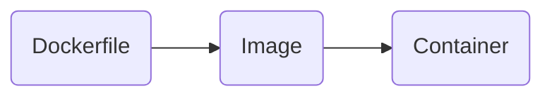

# Image

Image 又叫做 container image，就像是一個應用程式環境的 snapshot，這個 snapshot 記錄了某個時刻下有哪些已安裝的套件、環境變數與 file system 等，用來建立一個具有該環境的 container。

- Image 是根據 Dockerfile 建立 (build) 出來的，使用者透過撰寫 Dockerfile 來描述要建立什麼樣的 image
- ==Image is readonly==, so once it's built, it cannot be changed.

# Container

Container 是一個根據 image 建立 (build) 出來的環境，一個 host 上可以運行多個 containers，containers 之間互不干擾。

### Container 的狀態

![[docker-container-fsm.png]]

- 圖中的 "stopped" 也可以叫做 "exited"；"running" 也可以叫做 "up"