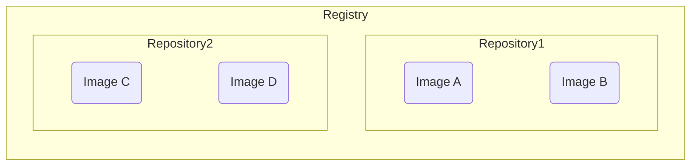

Docker Hub 是 Docker 官方提供的 container registry service，其它常見的 registry service 還有 [Amazon ECR](https://aws.amazon.com/ecr/)、GitHub container registry、GitLab container registry 等，我們也可以自己 host 自己的 registry service。

# Container Registry

Image 可以被我們 push 至 container registry 也可以讓我們從 container registry 中 pull 至 local，這讓開發同一個專案的團隊成員可以不須要各自在自己的 host 上 build image，達到節省時間與能源的效果。

# Registry vs. Repository

