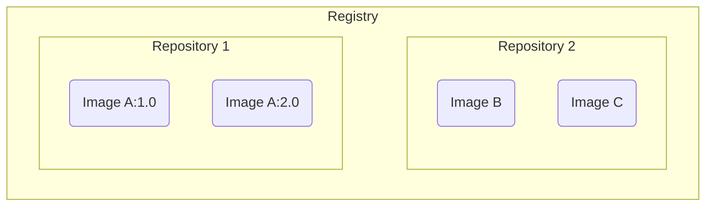

# Container Registry

Container registry 是放置 images 的倉庫（雖然名字中有 container 但其實放的不是 container）Image 可以被我們從 local **push** 至 container registry，也可以被我們從 container registry **pull** 至 local，這讓開發同一個專案的成員可以不須要各自在自己的 host 上 build image，達到節省時間與能源的效果。

Docker Hub 是 Docker 官方提供的 container registry service，其它常見的 registry service 還有 [AWS ECR](https://aws.amazon.com/ecr/)、GitHub container registry、GitLab container registry 等，我們也可以有一個 self-hosted registry service。

# Registry vs. Repository

如上圖所示，一個 registry 底下會有若干個 repositories，images 是放置在 repository 中。大家使用 repository 的習慣不同，有些人會將所有 images 都放在同一個 repository、有些人會將同一個應用程式會用到的所有 images 放在同一個 repository、有些人則只會將同一個 image 的不同版本放在同一個 repository。
