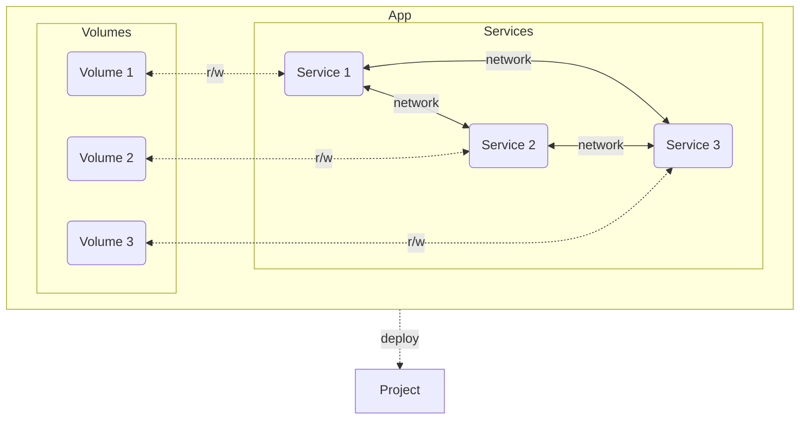

>Docker compose is a tool for defining and running multi-container application on a single host.

通常一個完整的應用程式／系統／服務會由不只一個部件／子系統／子服務構成，以一個 API service 為例，可能會有 API server、DBMS、in-memory cache、reverse proxy 等部件，有時候 API server 甚至不是單獨一個，而是多個 micro-services 互相協作，這種情況下，雖然每個部件都可以容器化（這已經大幅簡化了部署流程）但如果所有 containers 都須要各自被維護，開發者還要處裡 containers 間的 networks、dependencies 等設定，單純的容器化就顯得有些不足，因此我們須要一個工具方便開發者管理同一服務底下多個 containers，而 Docker Compose 就是一個這樣的工具。

>[!Info] 官方文件
><https://docs.docker.com/compose/>
# Installation

### On Linux Ubuntu

```bash
sudo apt-get update && sudo apt-get install docker-compose-plugin
```

若本來就已安裝好，則執行這個指令會將 `docker-compose-plugin` 的版本更新。

### On MacOS & Windows

Docker Compose 會被包在 Docker Desktop 裡。

# V1 & V2

Docker Compose v2 從 2022 年開始成為官方建議使用的版本，也是 Docker Desktop 4.4.2 後預設使用的版本，v1 則被標記為 deprecated。V2 主要的改動包括：

### `docker compose` 取代 `docker-compose`

Docker Compose 指令在 Docker CLI 中成為了一等公民，舊的 `docker-compose` 還是可以使用，只是它變成 `docker compose` 的 alias 了。

### Source Code 從 Python 改為 Go

整個 Docker 生態系幾乎都是用 Go 寫的，除了 Docker Compose v1 是用 Python，這導致功能的迭代速度較慢（因為相同的程式邏輯要寫兩種版本）好消息是 Docker Compose v2 選擇使用 Go 全部重構了，所以功能迭代的速度有望加快。

# Compose Application Model

Compose application model 描繪了在 Docker Compose 的框架下，一個應用程式的結構，這個 model 中重要的名詞包括 service、network、volume、config 與 secret：



### Service

一個應用程式由一到多個 services 組成，一個 service 就是一個 container，所以也會對應到一個 image（當然，如果整個應用程式只有一個 service/container 的話其實不須要用到 Docker Compose）。

### Network

Services 間透過 networks 溝通。Docker Compose 預設會讓同個應用程式中的所有 services 都可以與彼此溝通。

### Volume

Service 本身只有 memory 可以用來暫存資料，如果須要存取可長久儲存的資料，須要存到 volumes 裡。

- Volumes 裡的資料可以被搬移到其它 Docker host 上。
- 一個 volume 可以被多個 services 存取。

### Config

每個 service 可能會有運行時需要的特殊配置，這些配置會以檔案的形式被 mount 到 container 裡的 filesystem，所以當 config 有調整時，只須重啟 container 即可套用新的設定，不須 rebuild image。

### Secret

Secret 與 config 的原理相同，不過是用來傳入機敏資料。

# Compose File

執行 `docker compose` 指令時，Docker Compose 會根據指定的 compose file 來執行相應的動作，就像執行 `docker` 指令時須要有 Dockerfile 一樣。

Compose file 是一份描述如何建立並運行多個 containers、以及描述 container networks、container 使用的 volume/config/secret 的設定檔，compose file 的名稱須為 `compose.yaml` 或 `compose.yml` 或 `docker-compose.yaml` 或 `docker-compose.yml`（官方最推薦叫 `compose.yaml`；`docker-compose.yaml/yml` 則是 v1 時期所用的檔名，但 v2 也有向後兼容）。

>[!Note]
>關於 compose file 的詳細撰寫規則，請見[官方文件](https://docs.docker.com/reference/compose-file/)，這裡只會節錄幾個重點。

**Example**

```yaml
services:
  frontend:
    image: example/webapp
    ports:
      - "443:8043"
    networks:
      - front-tier
      - back-tier
    configs:
      - httpd-config
    secrets:
      - server-certificate

  backend:
    image: example/database
    volumes:
      - db-data:/etc/data
    networks:
      - back-tier

volumes:
  db-data:
    driver: flocker
    driver_opts:
      size: "10GiB"

configs:
  httpd-config:
    external: true

secrets:
  server-certificate:
    external: true

networks:
  front-tier: {}
  back-tier: {}
```

根據上面這份 compose file 建立出來的服務架構如下圖：

![[docker-compose-example.png]]

以下將分別介紹如何設定 compose application model 中的 service、network、volume、config 與 secret 這些元件：

### Service

### Network

### Volume

### Config

### Secret

# CLI

>[!Info] Recall
>Docker Compose CLI 自從 v2 後就已被整合進 Docker CLI 了，所以這裡介紹的指令都是 `docker compose` 開頭。

### 查看 Docker Compose 的版本

```bash
docker compose version [{OPTIONS}]
```

**常用的 Options**

|Option|Short|Description|
|:-:|:-:|---|
|`--short`| |只顯示版本號碼。|

### 列出所有 Docker Compose 管理的 Services

```bash
docker compose ls [{OPTIONS}]
```

**常用的 Options**

|Option|Short|Description|
|:-:|:-:|---|
|`--all`|`-a`|將沒有在運行的 service 也列出（否則只列出運行中的）。|

### 建立並啟動 Containers

```bash
docker compose [--file {PATH_TO_FILE}] up [{OPTIONS}] [{SERVICE_NAME} ...]
```

- `--file` (`-f`) 用來指定 docker-compose.yml 的路徑，若未提供，則預設是當前目錄中的 docker-compose.yml。
    - 請注意：這個 option 是放在 `compose` 與 `up` 之間。
- 若沒有提供 `{SERVICE_NAME}`，預設是啟動 docker-compose.yml 中的所有 services。

**常用的 Options**

|Option|Short|Description|
|:-:|:-:|---|
|`--build`| |若發現有 image 還沒 build，則先 build image。|
|`--detach`|`-d`|在背景運行 containers，所以不會看到 command output。|
|`--watch`|`-w`|監控 Dockerfile、docker-compose.yml 與所有 containers 內的檔案，若有改動則馬上 rebuild/refresh containers。|

### 停止並刪除 Containers

```bash
docker compose [--file {PATH_TO_FILE}] down [{OPTIONS}] [{SERVICE_NAME} ...]
```

- `--file` (`-f`) 用來指定 docker-compose.yml 的路徑，若未提供，則預設是當前目錄。
- 若沒有提供 `{SERVICE_NAME}`，預設是停止並刪除 docker-compose.yml 中的所有 services（包括 containers 與 networks）。

**常用的 Options**

|Option|Short|Description|
|:-:|:-:|---|
|`--rmi`| |連同相關的 images 一起刪除。|
|`--volumes`|`-v`|連同相關的 volumes 一起刪除。|

### 啟動／停止 Containers

```bash
# 啟動
docker compose [--file {PATH_TO_FILE}] start [{SERVICE_NAME} ...]

# 停止
docker compose [--file {PATH_TO_FILE}] stop [{SERVICE_NAME} ...]
```

- `--file` (`-f`) 用來指定 docker-compose.yml 的路徑，若未提供，則預設是當前目錄。
- 若沒有提供 `{SERVICE_NAME}`，預設是啟動／停止 docker-compose.yml 中的所有 services。

### 在正在運行的 Container 中執行指令

```bash
docker compose exec [{OPTIONS}] {SERVICE_NAME} {COMMAND}
```

這個指令的效果類似於 `docker exec {CONTAINER_ID} {COMMAND}`，差別在這裡是用 compose file 中寫的 service name 來指定 container。

**常用的 Options**

|Option|Short|Description|
|:--|:-:|---|
|`--detach`|`-d`|在背景執行指令，所以不會看到指令的輸出。|
|`--env {KEY}={VALUE}`|`-e`|設定環境變數。|
|`--user {USER}`|`-u`|以指定的 user 身份執行指令。|
|`--workdir {PATH}`|`-w`|在指定路徑下執行指令。|

### 新建一個 Container 並在 Container 中執行指令

```bash
docker compose run [{OPTIONS}] {SERVICE_NAME} {COMMAND}
```

與 `docker compose exec` 的差別在於，`docker compose run` 會新建一個 container。

|Option|Short|Description|
|:--|:-:|---|
|`--detach`|`-d`|在背景執行指令，所以不會看到指令的輸出。|
|`--env {KEY}={VALUE}`|`-e`|設定環境變數。|
|`--user {USER}`|`-u`|以指定的 user 身份執行指令。|
|`--workdir {PATH}`|`-w`|在指定路徑下執行指令。|
|`--rm`| |指令完執行且離開 container 後，自動刪除 container。|

### 查看 Container 的 Log

```bash
docker compose logs [{OPTIONS}] {CONTAINER_ID}
```

**常用的 Options**

|Option|Short|Description|
|:--|:-:|---|
|`--follow`|`-f`|持續監控 logs，不結束指令。|
