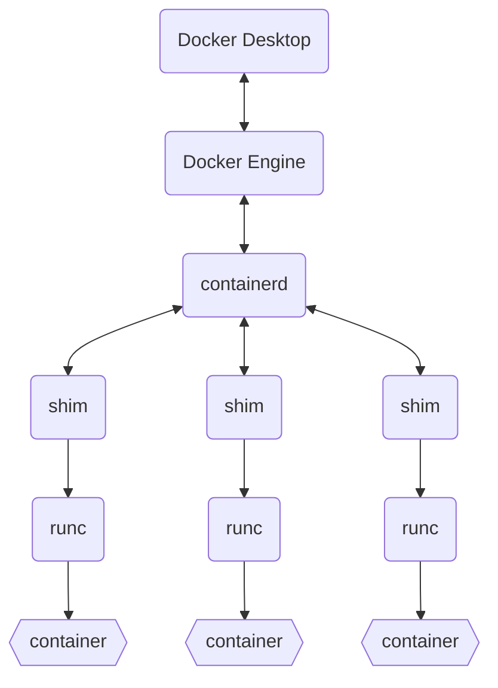

#TODO 

### containerd

負責 "pull/download image from a registry"、"manage containers' lifecycle"。實際上 "run container" 的工作也不是由 `containerd` 負責，而是透過更底層的 `runc`，`containerd` 透過 `shim` 與 `runc` 溝通。

### runc

`runc` 是實際運行 container 時所用的 runtime，負責直接與 host 的 OS 溝通。

>[!Info]
>runc 是 OCI 的第一個 open source project。
