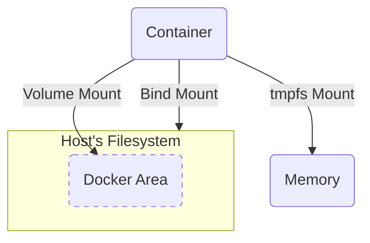

# Volume

Volume 是==將 container 內的資料同步寫入 host's filesystem== 的功能，所以 volume 內的東西不會隨著 container 被刪除而消失（除非刪除 container 時有特別要求）。同一個 volume 還可以讓不同 containers 存取，達到 containers 共享資料的效果。

### Volume 中的資料放在 Host 的哪裡？

- Linux: /var/lib/docker/volumes/

- MacOS: 在 virtual machine 裡的 /var/lib/docker/volumes/

    但因為我們很難直接從 host 去存取 VM 裡的 filesystem，所以建議在 MacOS 上使用 [#Bind Mount](</./Tools/Docker/7 - Storage in Docker.draft.md#Bind Mount>)。

### 將 Container 與 Volume 連接

步驟如下：

##### Step 1: (Optional) Create Volume

```bash
docker volume create {VOLUME_NAME}
```

其實可以省略這個步驟，因為執行 `docker run` 時若找不到指令中所指定的 volume，Docker 會自動幫我們建立一個。

##### Step 2: Volume Mount

在 `docker run` 指令中可以用 `--volume` (`-v`) 或 `--mount` option 來進行 volume mount：

- 方法一：使用 `--volume` (`-v`)

    ```bash
    docker run -v {VOLUME_NAME}:{CONTAINER_PATH} {IMAGE}
    ```

- 方法二：使用 `--mount`

    ```bash
    docker run --mount type=volume,src={VOLUME_NAME},target={CONTAINER_PATH} {IMAGE}
    ```

官方推薦一律使用 `--mount`，因為 `--mount` 可以做到所有 `--volume` 做得到的事，且功能比 `--volume` 齊全。

# Bind Mount

**方法一：使用 `--volume`**

```bash
docker run -v {HOST_PATH}:{CONTAINER_PATH} {IMAGE}
```

**方法二：使用 `--mount`**

```bash
docker run --mount type=bind,src={HOST_PATH},target={CONTAINER_PATH} {IMAGE}
```

- Bind mount 的功能是將 host 指定路徑的檔案「掛載」到 container 內，使得兩邊的資料同步更動。
- 如果希望編輯中的程式碼或 compiled binary 可以即時地反應到容器化的 development server，則須要將 codebase 或 compiled binary "bind mount" 到 container 中。
- Volumes 是一種由 Docker 控管的 bind mount。

### Volume Mount vs. Bind Mount
  
| |Volumes Mounts|Bind Mounts|
|--|--|--|
|Host location|Docker chooses|You decide|
|Populates new volume with container contents|Yes|No|
|Supports Volume Drivers|Yes|No|

# `tmpfs` Mount

#TODO 

# Volume Driver

# Storage Driver

Storage driver 與 volume driver 的功能不同，是拿來儲存 image layers 的。

#TODO 

# Summary



Volume mount 與 bind mount 在指令上的差異：

- Volume mount: `type=volume,src={VOLUME_NAME},target={CONTAINER_PATH}`
- Bind mount: `type=bind,src={HOST_PATH},target={CONTAINER_PATH}`
