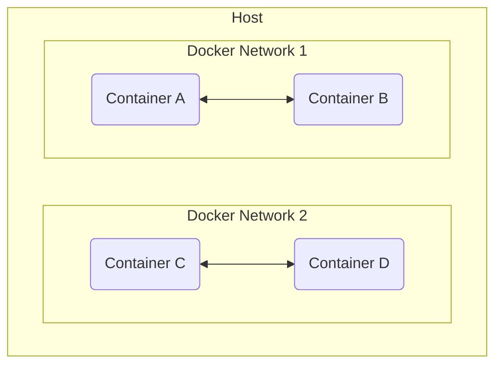

一個 host 上的各個 containers 之間原則上不能直接溝通，但在一個 multi-container application 中，containers 間勢必得溝通（比如 API server 須要跟 DBMS 拿資料）要讓 containers 間互相溝通就必須先在它們之間建立 **network**：

同一個 network 中的 containers 可以用彼此的 container name 或者它們在 network 中的 IP address 與對方溝通，不須要使用 `localhost` 或 `127.0.0.1`，也就是說這些 containers 不須要先 publish ports 到 host 上就可以和彼此溝通。

一個 container 可以同時位於多個 networks 中，每個 container 在每個 network 中會有不一樣的 IP address。

>[!Info]
>與 network 相關的指令請看[這篇](</Tools/Docker/2 - Docker CLI.md#與 Network 相關的指令>)。

# Network Driver

### Network Driver 的種類

|Driver|Description|
|---|---|
|`bridge`|The default network driver.|
|`host`|Remove network isolation between the container and the Docker host.|
|`none`|Completely isolate a container from the host and other containers.|
|`overlay`|Overlay networks connect multiple Docker daemons together.|
|`ipvlan`|IPvlan networks provide full control over both IPv4 and IPv6 addressing.|
|`macvlan`|Assign a MAC address to a container.|

然而，container 並不會之道它所使用的 network 是哪一種，也不會知道 network 另外一邊的溝通對向是誰，對 container 來說，它只會看到一堆 network interfaces，每個 interface 上面的資訊只有可連線對向的 IP address、routing table、gateway、DNS service 這些資訊。

#TODO 

# Publishing Ports

如果你希望不只 containers 間可以互相溝通，user 也可以透過 host 和 container 溝通，那麼就須要將 container 身上的 port "publish" 到 host 身上的某個 port。

以下將介紹使用不同方式啟動 container 時應如何 publish ports：

### 在 `docker run` 指令中

在 `docker run` 指令中，是使用 `--publish`（簡寫 `-p`）option 來做 port publishing，用法包括：

|Flag value|Description|
|---|---|
|`-p 8080:80`|Map port `8080` on the Docker host to TCP port `80` in the container.|
|`-p 192.168.1.100:8080:80`|Map port `8080` on the Docker host IP `192.168.1.100` to TCP port `80` in the container.|
|`-p 8080:80/udp`|Map port `8080` on the Docker host to UDP port `80` in the container.|
|`-p 8080:80/tcp -p 8080:80/udp`|Map TCP port `8080` on the Docker host to TCP port `80` in the container, and map UDP port `8080` on the Docker host to UDP port `80` in the container.|

### 在 compose.ymal 中

#TODO 
