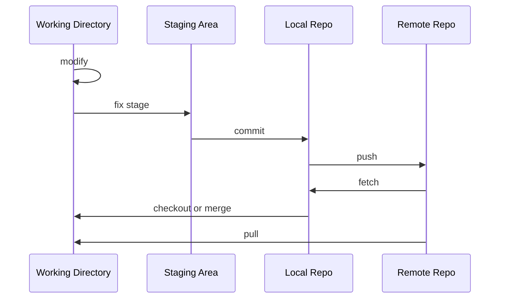
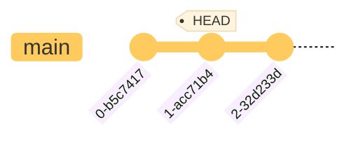
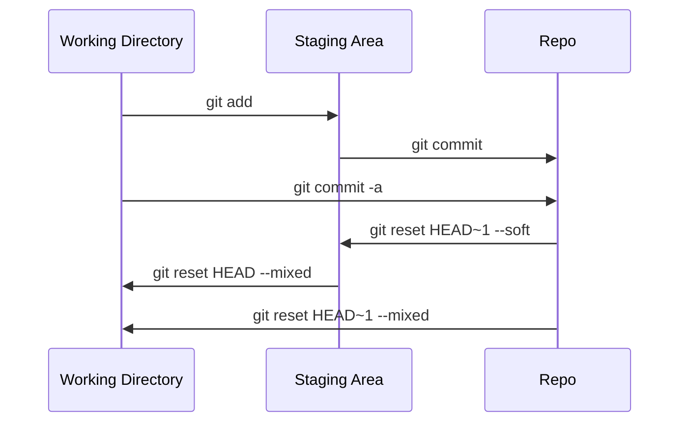

# 初始化一個 Repository

```bash
git init
```

- 此指令須在專案的 root directory 執行，每個專案只須要執行一次
- 無論是已經行之有年的專案，或者是剛建立的專案，都可以使用這個指令將 Git 導入

此時專案根目錄會多一個叫 **.git** 的 directory，且裡面已經有一些子目錄與檔案，==.git directory 就是所謂的 **repository**==，是未來對這個專案進行版本控制時會用到的唯一 directory（關於 .git file 的詳情，請見 [The .git Folder](</Tools/Git/The .git Folder.md>)）。

# Commit 初體驗

在 [L1](</Tools/Git/1 - Introduction.md#📌 檔案在 Git 裡的狀態>) 有提到檔案在 Git 裡的各種狀態，讓我們回顧一下這張圖：



現在就讓我們一步一步來了解要如何使用指令把一個檔案從 working directory 放到 staging area，再從 staging area 正式提交到 local repo 吧！

---

### Working Directory → Staging Area

```bash
git add {FILE1} [{FILE2} ...]
```

使用 `git add` 指令可以將 working directory 中（狀態為 Untracked、Modified 或者 Deleted）的檔案搬移到 staging area（使其狀態變成 Staged）。

也可以使用 `--all` option 一次將「所有」狀態為 Untracked、Modified 以及 Deleted 的檔案搬移到 staging area：

```bash
git add --all
# or
git add -A
# or
git add .
```

`git add --all` 等價於 `git add -A`，但 ==`git add .` 的效果其實不完全等於前兩者==，有以下兩點須注意：

1. 因為 `.` 指的是「目前所處的目錄的所有檔案」，因此如果不是在專案根目錄執行 `git add .`，就只會把執行指令時所處的 sub-directory 中的檔案放進 staging area；但 `git add --all` 無論在哪個 sub-directory 執行都會把 repo 中所有狀態有變更的檔案放進 staging area
2. 在 Git 1.x 中，`git add .` 並不會把狀態為 "Deleted - Unstaged" 的檔案加進 staging area，但 `git add --all` 會

---

### Staging Area → Repository

```bash
git commit [-m "{COMMIT_TITLE}" [-m "{COMMIT_DESCRIPTION}"]]
```

使用 `git commit` 指令可以將 staging area 中的檔案正式提交到 repo，使其狀態變為 Committed/Unmodified。

##### Commit Message

Commit 時必須附上 message，message 分為 title 與 description 兩個部分。

若想輸入的 commit message 很長，不想直接在指令中寫，那輸入指令時可以先不要輸入 `-m` option 以及後面的 message（輸入 `git commit` 即可），如此一來 Git 就會[打開一個文字編輯器](</Tools/Git/2 - 安裝與設定.md#設定編輯器>)，讓你更舒服地撰寫 commit message。

>[!Note]
>關於 commit message 格式的詳細敘述，請見[本文](</Tools/Git/Commit Message.md>)。

### 一步完成 `git add` 與 `git commit`

```bash
git commit -a -m "{COMMIT_TITLE}"
```

上面這個指令會「近似於」`git add --all` + `git commit -m "my message"`，只有「近似」的原因是因為 ==`-a` option 只會把狀態為 modified 與 deleted 的檔案加進 staging area，untracked 的檔案不會被加進去。==

>[!Note] 空的 Sub-directory 會被無視
>Git 紀錄的是「檔案」的內容，所以一個空的 sub-directory 並不會被 Git 納入管控。

# 反過來怎麼做？

前面介紹了如何把一個檔案的變動從 working directory 搬到 staging area，以及從 staging area 搬到 repo，那這些動作可以倒轉嗎？換句話說，如果我在 `git add` 或 `git commit` 後後悔了，可以反悔嗎？

>[!Note]
>在繼續閱讀本段之前，建議先了解 [HEAD](</Tools/Git/HEAD.md>) 是什麼。
>
### Repository → Staging Area

```bash
git reset HEAD~1 --soft
```

此時最近一個 commit 所記錄的檔案變動會被移到 staging area，且 `HEAD` 會改指向倒數第二個 commit：



由於檔案的變動只是從 repo 跑到 staging area，所以此時檔案內容不會變，仍然是最近一版的。

### Staging Area → Working Directory

```bash
git reset HEAD --mixed
# or
git reset
# or
git restore --staged {FILE_OR_DIR}
# or
git restore -S {FILE_OR_DIR}
```

- 這個動作叫 **unstage**。由於檔案的變動只是從 staging area 跑到 working directory，所以檔案的變動會被保留
- `HEAD` 其實可以省略不寫
- `reset` 的模式預設即為 `--mixed`，所以也可以省略不寫 `--mixed`
- `restore` 可以指定檔案／目錄；`reset` 只能一次 unstage 所有檔案
- 若想使用 `restore` unstage 所有檔案，則須在 repo 的 root directory 執行 `git restore -S .`

### Repository → Working Directory

```bash
git reset HEAD~1 --mixed
# or
git reset HEAD~1
```

`git reset HEAD~1 --mixed` = `git reset HEAD~1 --soft` + `git reset HEAD --mixed`

---

下面這張圖描繪了如何使用各種指令將檔案的變動進行搬移：



>[!Note]
>上述動作皆不會動到檔案內容，若想要實際「回到上一個版本」須使用 `reset --hard` 指令，關於「回到上一個版本」的完整介紹請見[本文](</Tools/Git/reset、revert、rebase.canvas>)。

# 如何讓整個專案脫離 Git 管控？

由於 .git 是 Git 用來達成版本控制的唯一 folder，因此若要讓整個專案脫離 Git 管控，就直接==將 .git 整包刪除==即可！

須注意的是，一旦將 .git 刪掉就意味著關於此專案所有的歷史版本都會遭到刪除，只剩下刪除當下的 working directory，如果刪掉 .git 後你後悔了，除了去垃圾桶找之外，剩下的指望就剩從 remote repo 拿了。

>[!Note]
>更多關於 .git 的詳情，請見[本文](</Tools/Git/The .git Folder.md>)。
