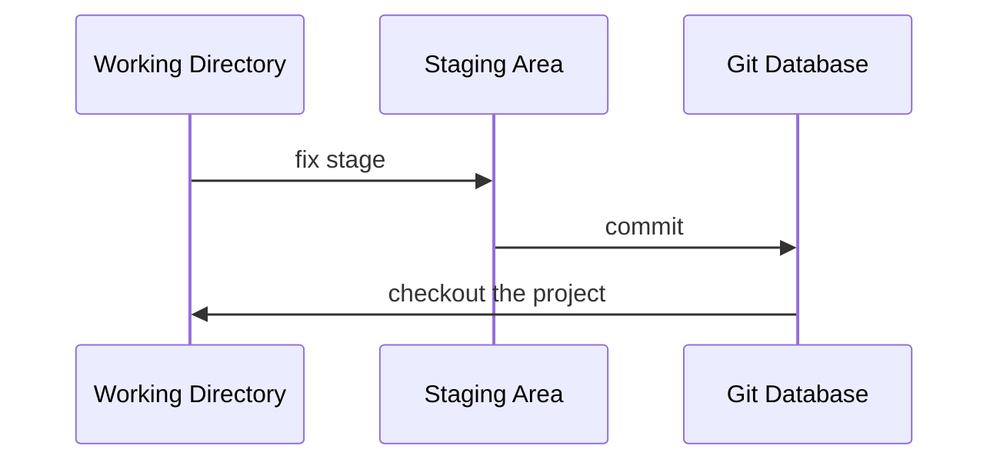
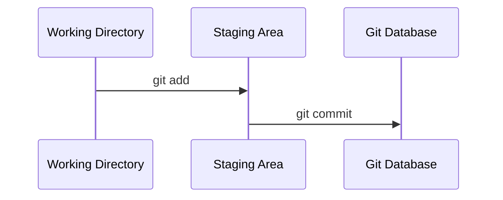

# 初始化一個 Git Repo

無論是已經行之有年的專案，或者是剛建立的專案，Git 隨時可以被導入其中，要讓一個專案被 Git 管控，就必須在該專案的根目錄執行以下指令：

```bash
git init
```

這個指令在每個專案中只須要執行一次。

現在，你的專案不再只是一個專案，它同時還是一個 **repository**。

執行這個指令後，你會發現專案根目錄多了一個叫做 `.git` 的 directory，且裡面已經有一些 sub-directories 與 files，`.git` directory 就是未來用來進行這個專案的所有有關本控制的動作時會用到的唯一 directory，裡面包含了版本控制資料庫、local 設定檔… 等，詳情請見 [[The .git Folder]]。

# Commit 初體驗

在 [[CH1 - Intro to Git#📌 檔案在 Git 裡的狀態|CH1]] 有提到檔案在 Git 裡的各種狀態，讓我們回顧一下這張圖：



現在就讓我們一步一步來了解要如何使用指令把一個檔案從 Working Directory 放到 Staging Area，再從 Staging Area 正式提交到 Git Database 吧！

---

### Working Directory $\rightarrow$ Staging Area

使用 `git add` 指令可以將 working directory 中（狀態為 Untracked、Modified 或者 Deleted）的檔案搬移到 staging area（使其狀態變成 Staged），command pattern 如下：

```sh
git add <FILE1> [<FILE2> ...]
```

也可以使用 `--all` option 一次將「所有」狀態為 Untracked、Modified 以及 Deleted 的檔案搬移到 staging area：

```bash
git add --all
# or
git add -A
# or
git add .
``` 

`git add --all` 等價於 `git add -A`，但 ==`git add .` 的效果其實不完全等於前兩者==，有以下兩點須注意：

1. 因為 `.` 指的是「目前所處的目錄的所有檔案」，因此如果不是在專案根目錄執行 `git add .`，就只會把執行指令時所處的 sub-directory 中的檔案放進 staging area；但 `git add --all` 無論如何都會把 repo 中所有狀態有變更的檔案放進 Staging Area

2. 在 Git 1.x 中，`git add .` 並不會把狀態為 Deleted (Unstaged) 的檔案加進 staging area，但 `git add --all` 會

>[!Warning]
>請謹慎使用 `git add --all`/`git add -A`/`git add .`，因為 Staging Area 是變動進入 Git Database 前的最後一道防線，你必須很清楚自己允許了哪些東西進入 Staging Area。

---

### Staging Area $\rightarrow$ Git Database

使用 `git commit` 指令可以將 staging area 中的檔案正式提交到 Git database，使其狀態變為 Commited/Unmodified，commit 時必須附註 message，command pattern 如下：

```bash
git commit [-m "<COMMIT_TITLE>" [-m "<COMMIT_DESCRIPTION>"]]
```

commit message 的內容有長度限制，且有 title 與 description 之分，若想輸入的 commit message 並不像上方指令一樣可以一行解決，那輸入指令時可以先不要輸入 `-m` option 以及後面的 message（輸入 `git commit` 即可），如此一來 Git 就會[[CH2 - Git 安裝與設定#設定編輯器|打開一個文字編輯器]]，讓你更有彈性地編輯 commit message，關於 commit message 格式的詳細敘述，請見 [[Commit Message|本文]]。

有了 `git add` 以及 `git commit` 這兩個指令，我們可以把上方流程圖的部分動作用指令代替：



---

### 一步完成 `git add` 與 `git commit`

```bash
git commit -a -m "<COMMIT_TITLE>"
```

上面這個指令會「近似於」`git add --all` + `git commit -m "my message"`，只有「近似」的原因是因為 ==`-a` option 只會把狀態為 modified 與 deleted 的檔案加進 staging area，untracked 的檔案不會被加進去。==

>[!Note] 空的 Sub-directory 會被無視
>Git 紀錄的是「檔案」的內容，所以一個空的 sub-directory 並不會被 Git 納入管控。

# 查看 Repo 的狀態

```bash
git status
```

這個指令不只會 output 目前 repo 的狀態，還會提示你應該做什麼動作，像是這樣：

```plaintext
On branch main
Changes not staged for commit:
  (use "git add <file>..." to update what will be committed)
  (use "git restore <file>..." to discard changes in working directory)
        modified:   .gitignore

Untracked files:
  (use "git add <file>..." to include in what will be committed)
        test1

no changes added to commit (use "git add" and/or "git commit -a")
```

或是這樣：

```plaintext
On branch main
nothing to commit, working tree clean
```

如果只是想大概看一下目前的狀態，也可以加上 `--short` (`-s`) 讓 output 精簡一點，通常建議也搭配 `--branch` (`-b`) 使用：

```bash
git status -sb
```

Output:

```plaittext
## main
 M test1
```

# 如何使專案脫離 Git 管控？

由於 `.git` 是 Git 用來達成版本控制的唯一 folder，因此若要使專案脫離 Git 管控，就直接==將 `.git` 整包刪除==即可！

須注意的是，一旦將 `.git` 刪掉就意味著關於此專案所有的歷史版本都會遭到刪除，只剩下刪除當下的 working directory 這個版本，如果刪掉 `.git` 後你後悔了，除了去垃圾桶找之外，唯一的指望就剩從 remote repo 或者別人的 local repo 拿了……

更多關於 `.git` folder 的詳情請見 [[The .git Folder|本文]]。

# 部分檔案或子目錄不想被 Git 紀錄怎麼辦？

通常有幾種情況我們會希望檔案不要被 Git 紀錄：

- 某檔案含有機敏資訊，比如金鑰或帳號密碼，常見的如 `.env`
- 很大包但可以輕易從網路上取得的資源，比如 `node_modules/`
- 編輯器的設定檔，如 `.vscode/`
- 每次運行程式碼時都會產生的不必要的檔案，如 `__pycache__`、`.log`
- 其他…

此時可以將不想被 Git 控管的 file 或 sub-directory 條列在一個叫做 `.gitignore` 的檔案內，這樣這些檔案從被產生開始就不會被納入 Git 的管控。

### `.gitignore` 要放哪？

`.gitignore` 的位置會在專案的 root directory（和 `.git` folder 同層）。

### `.gitignore` 範例

```plaintext
.env
*.log
*.py[cod]
/site
.vscode/
docs/_build/
```

詳細撰寫方式請見[[深入 .gitignore File#如何撰寫？]]。

GitHub 團隊有在 GitHub 上提供常見的 `.gitignore` [範例](https://github.com/github/gitignore)。

### 已經被管控的檔案怎麼脫身？

`.gitignore` 只對狀態為 Untracked 的檔案有效，所以==單純將一個已經被 Git 控管的檔案加入 `.gitignore` 是沒有用的==，Git 還是會繼續紀錄這個檔案的所有更動，要想讓這個檔案脫離，除了要將檔名加入 `.gitignore` 外，還須進行兩個動作：

```bash
# Step1
git rm <FILE_NAME> --cached

# Step2
git commit -m "<COMMIT_TITLE>"
```

檔案的狀態變化過程如下：

```mermaid
flowchart TD
    id1(Commited/Unmodified)
    id2("Deleted (Staged) and Untracked")
    id3(Untracked)
    id4(Ignored)
    id1 --git rm --cached --> id2
    id2 --git commit--> id3
    id3 --add to .gitignore--> id4
```

由於 `.gitignore` 檔案本身被更改後通常也要被 commit，所以通常動作的順序會是先 `git rm <FILE_NAME> --cached`，再將檔案名稱加入 `.gitignore`，最後才一起 commit。

### 後悔了怎麼辦？

若執行 `git rm <FILE_NAME> --cached` 後後悔了，想要讓檔案從 **Deleted (Staged) and Untracked** 狀態變回原本 **Commited/Unmodified** 的狀態，可以使用 `git reset <FILE_NAME>`。事實上，若要 unstage 已經進入 staging area 的變動，都可以使用 `git reset`（關於 `git reset` 的詳情請見[[本文]]）。

若是已經 commit 了才後悔，則應使用 `git revert` 將該 commit 的變動反轉（關於 `git revert` 的詳情請見[[本文]]）。

>[!Question] 可以 ignore `.gitignore` 嗎 🤯？
>可以！只是通常不會這麼做。
