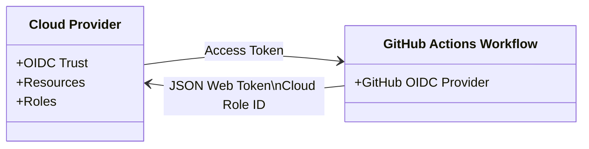

# GitHub Action

[GitHub Actions vs. Jenkins](https://spacelift.io/blog/github-actions-vs-jenkins)

#TODO 

# 使用 OIDC 讓 Workflow 連接雲端服務

[官方文件](https://docs.github.com/en/actions/deployment/security-hardening-your-deployments/about-security-hardening-with-openid-connect)

#TODO 

# 參考資料

- [官方文件](https://docs.github.com/en/actions/using-workflows)
- [如何撰寫 Workflow Syntax？](https://docs.github.com/en/actions/using-workflows/workflow-syntax-for-github-actions)
