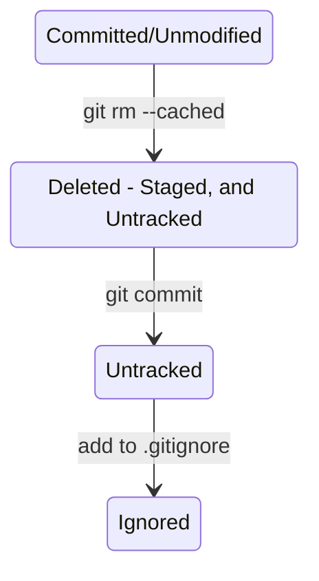
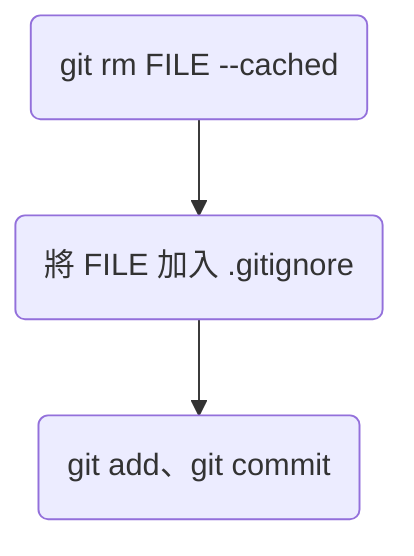

# 有些檔案或子目錄不想被 Git 管理？

通常有幾種情況我們會希望檔案不要被 Git 管理：

- 檔案含有金鑰、帳號、密碼等機敏資訊，比如 .env
- 很大包但可以輕易從網路上取得的資源，比如 node_modules/
- Local 編輯器的設定檔，如 .vscode/
- 每次運行程式碼時都會產生的不必要的檔案，比如 \_\_pycache\_\_、.log

此時可以將不想被 Git 控管的檔案或子目錄條列在一個叫做 **.gitignore** 的檔案內，這樣這些檔案從被產生開始就不會被納入 Git 的管控。.gitignore 的位置會在專案的 root directory（和 [[The .git Folder|.git folder]] 同一層）。

### 已經被管控的檔案怎麼脫身？

.gitignore 只對狀態為 Untracked 的檔案有效，所以==單純將已被 Git 控管的檔案加入 .gitignore，Git 還是會繼續紀錄這個檔案的所有更動==，要想讓這個檔案脫離 Git，除了要將檔名加入 .gitignore 外，還須做以下兩個動作讓 Git 遺忘這個檔案：

```sh
# Step1
git rm <FILE> --cached

# Step2
git commit -m "<MESSAGE>"
```

檔案狀態的變化過程如下：



由於 .gitignore 檔案本身被更改後通常也要被 commit，所以通常執行順序會是：



### 後悔了怎麼辦？

若是執行 `git rm <FILE> --cached` 後後悔了，想要讓檔案從 Deleted - Staged, and Untracked 變回 Committed/Unmodified，可以使用 `reset` 指令：

```sh
git reset <FILE>
```

若是已經 commit 了才後悔，則應使用 `git revert` 將該 commit 的變動反轉（關於 `git revert` 的詳情請見[[reset、revert|本文]]）。

>[!Note]
>只要是想 unstage 已進入 staging area 的檔案變動，都可以使用 `git reset`，關於 `git reset` 的其它用法，請見[[reset、revert|本文]]。

---

>[!Question] 可以 ignore .gitignore 嗎 🤯？
>可以，只是通常不會這麼做。

# 如何撰寫 .gitignore？

範例：

```plaintext
.env
*.log

# This is comment
*.py[cod]
/site
.vscode/
docs/_build/
```

.gitignore 所使用的文件撰寫格式稱為 **Glob**，glob 的撰寫方式與 regular expression 類似，有以下幾種用法：

- `*` 代表 0 到多個任意字元
- `?` 代表 1 個任意字元
- `[]` 代表範圍
    - `[abc]` 代表 1 個 `a` 或 `b` 或 `c` 字元
    - `[a-z]` 代表 a~z 任一個字元
    - `[0-9]` 代表 0~9 任一個字元
- 結尾加上 `/` 代表只 ignore 目錄，不加則代表檔案與目錄都 ignore
    - 比如 `.env`，代表名為 `.env` 的檔案與目錄都會被 ignore
- 開頭加上 `/` 代表 root directory，不加則代表任意 path 底下的都會被 ignore
    - 比如 `/site`，代表只有 root directory 底下的 `site` 檔案與目錄要被 ignore，`.vscode/` 則表示任意路徑底下的 `.vscode` 目錄都會被 ignore；`.env` 表示任何路徑底下的 `.env` 檔案與目錄都會被 ignore
- 在 path 中使用 `**` 代表中間可以有若干層
    - 比如 `a/**/z`，代表 `a/z`、`a/b/z`、`a/b/c/z` 等 path 都算
- `$` 代表結尾
- 可以使用 `()`
    - 比如 `([abc]*)` 代表任意數量的 `a` 或 `b` 或 `c` 字元
- 開頭為 `#` 者，會被視為註解

>[!Note]
>GitHub 團隊有在 GitHub 上提供常見的 .gitignore [範例](https://github.com/github/gitignore)。

# 刪除被 Ignore 的檔案與子目錄

```bash
git clean -fXd
```

>[!Danger]
>這是一個危險的指令，因為這些檔案沒有被 Git 控管，所以刪掉後沒辦法用 Git 救回來。

>[!Note]
>關於更多 `git clean` 的使用方式請見[[本文]]。
