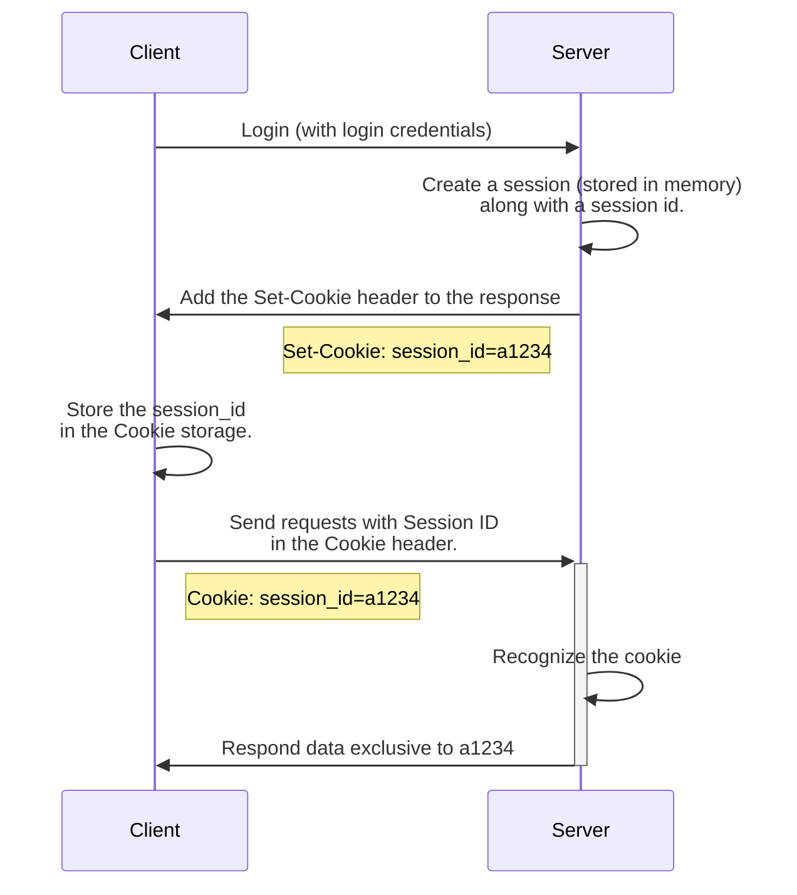
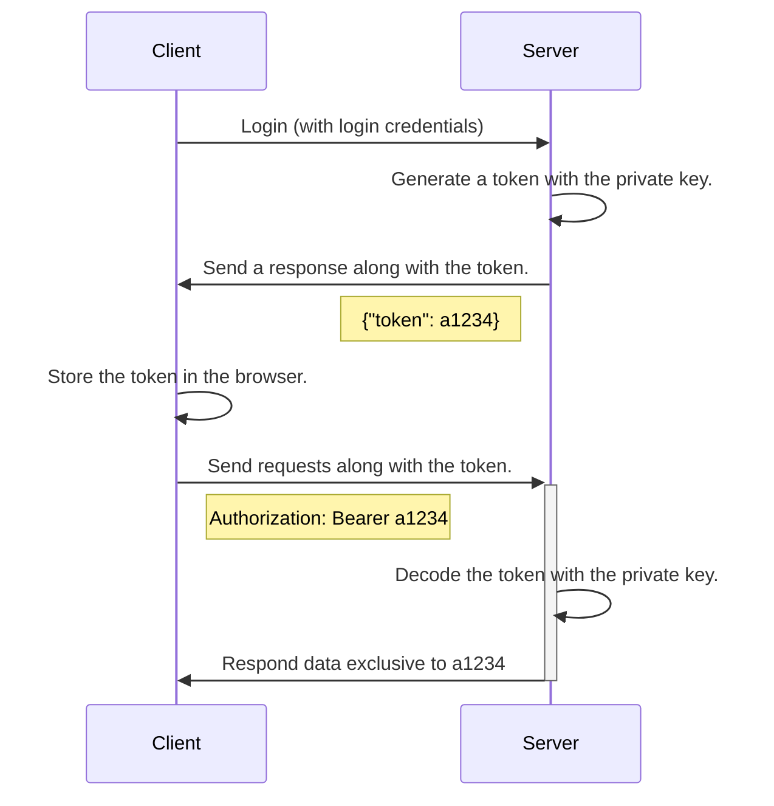

#Cookie #Authentication

# Cookie-Based Authentication

^71972f

Cookie-Based Authentication 最原始的意思是「將使用者的資訊（狀態）全部塞進 `Cookie` Header」，但由於以下兩個原因：

1. Cookie 有大小上限（4 KB）
2. Request 若被攔截，放在 `Cookie` Header 裡的使用者資訊就洩露了

因此後來慢慢演變為只攜帶 **Session ID** 在 `Cookie` Header 中，server 再根據 Session ID 找到對應的使用者，必要時再查詢該使用者的資訊並回傳。

由於整個 Authentication 的過程分別在 client-sdie 與 server-side 用到了 Cookie 與 Session 兩個技術，因此又叫做 ==**Cookie/Session Authentication**==，這也是本段主要想探討的。

Cookie/Session Authentication 的流程如下圖：

在 Server side 所建立的 Session，其功能是紀錄那些原本想塞進 Cookie 的使用者基本資訊。Session 通常會具有時效性，且通常是 key-value pair，因此常會使用 Redis 來實作。

其實，「Server 使用 Session 來紀錄使用者的登入狀態」這件事某種程度上已經違反了 [[REST API|REST]] 架構中的 Stateless 原則。

### 優點

搭配上 [[Cookies (1)：設置與存取#^c4df56|HttpOnly]] 以及 [[Cookies (1)：設置與存取#^e008c9|Secure attribute]] 的 session id/auth cookie，可以防止受到 [[CSRF Attack 與 XSS Attack#XSS Attack|XSS Attack]]，並且，當被竊聽時，cookie 的明文也不會被竊聽者取得。

### 缺點

^ed0284

- 只有在 **「server 與 client 的網域相同」** 時才能運作，因為如果 server 與 client 的網域不同（現今前後端分離的開發模式很常出現這種現象），那麼 client 就不會自動攜帶 Cookie 了。

- 因為 cookies 會自動被 request 帶上，所以 cookie-based authentication 容易受到 [[CSRF Attack 與 XSS Attack#CSRF Attack|CSRF Attack]]，但其實還是有以下兩種方式可以預防：
    - 將 Session ID 這個 cookie 的 [[Cookies (1)：設置與存取#^5ed6f2|SameSite]] attribute 設為 `Lax`，搭配上 server-side 使用「GET method **以外**的 API」
    - 將 Session ID 這個 cookie 的 `SameSite` attribute 設為 `Strict`
    - CSRF token

- 如果有些每次溝通都必須夾帶的基本資料，但又不想直接存在 Cookie，就等於每次都要進 Session 所使用的資料庫查詢該基本資料，這顯得有點蠢。

### 其實也不一定要用 Cookie

^b76908

從 [[瀏覽器中的儲存空間]] 一文我們已經知道，client side 儲存資料的地方至少有三種，因此其實廣義來說，Session ID 可以存在這三個地方中的任意處，只要在送出 request 時記得帶上，那就算是 Cookie/Session Authentication 了。

唯一要注意的就是，若不把 Session ID 存在 Cookie（儲存空間），就無法利用「Request 會自動帶上 Cookie」這個特質，必須另外寫一段 JavaScript 來將 Session ID 塞進 request 的任一部份，至於是哪一部份，則須由前後端自行約定，比如：

1. HTTP request 的 `Authorization` Header
2. POST method 的 request body
3. GET method 的 query string

### 不使用 Cookie 的優點

事實上儲存空間有了 Cookie 以外的選擇後，等同於解決了 [[#^ed0284|缺點]] 中的前兩點：

1. 若前後端所在的網域不同，還是可以主動用 JavaScript 將 Session ID 塞進 request
2. 若採用 JavaScript 主動將 Session ID 塞進 request 的方式，就意味著不像 cookies 一樣會被自動攜帶，也就不會有 [[CSRF Attack 與 XSS Attack#CSRF Attack|CSRF Attack]] 的問題

### 不使用 Cookie 的缺點

^bbefb8

**Vulnerable to XSS Attack**

由於須採用 JavaScript 主動將 Session ID 塞進 request，就意味著 JavaScript 可以存取到存在瀏覽器中的 Session ID，也就意味著 [[CSRF Attack 與 XSS Attack#XSS Attack|XSS Attack]] 是有效的。

# Token-Based Authentication

^1ef2e6

在條列 Cookie-Based Authentication 的缺點時，我們最後一點提到：

>如果有些每次溝通都必須夾帶的基本資料，但又不想直接存在 Cookie，就等於每次都要進 Session 所使用的資料庫查詢該基本資料，這顯得有點蠢

其實 Token-Based Authentication 可以說正是針對這個痛點而生，這裡的 token 通常需具備下列三個特點：

1. 夾帶部分使用者資訊
2. 具唯一性
3. 具時效性
4. 看起來像亂碼（經過加密）

與 Cookie-Based Authentication 相同的是，token 也可以存在 [[瀏覽器中的儲存空間|瀏覽器的任一種儲存空間]]，當 client 對 server 送出 request 時，再使用 JavaScript 將 token 塞進 request 的 [[#^b76908|任一部份]] 即可。

常見的 Token-Based Authentication 為 [[JWT]]。

### 優點

1. 針對那些每次溝通都必須夾帶的基本資料，可以直接夾帶在 token 裡，如此一來就不用每次都進 Session 所用的資料庫查。

2. 只要不是放在 Cookie 裡，就沒有受到 [[CSRF Attack 與 XSS Attack#CSRF Attack|CSRF Attack]] 的風險，事實上通常採用 Token-Based Authentication 時都不會選擇存在  Cookie 然後讓 Request 自動帶上，所以有時候你會看到 ==**Cookieless Authentication**== 這個名詞。

### 缺點

1. 與 Cookie-Based Authentication 中 [[#^bbefb8|不使用 Cookie 的缺點]] 相同，因為可以用 JavaScript 存取瀏覽器裡的 token，所以有受到 XSS Attack 的風險。

2. 隨著 token 裡夾帶著資訊越多，token 的大小就越大，進而拉長傳輸時間。

### 注意事項

雖說可以夾帶部分使用者資訊且有經過 encoding，但還是不要放入機敏資訊（比如密碼），因為 encoding function 通常是公開的，竊聽者若知道該 function，那 decoding 就易如反掌了。

# Token/Session ID 存哪比較好？

假如你已經讀過 [[瀏覽器中的儲存空間]] 一文，你應該對各種儲存位置的特性已經相當了解，以下我們一一分析將 token 存在不同位置的特色或優缺點：

### Session Storage

- 特色

    因為 session storage 在 browser 關閉後便會被清空，所以再次打開 browser 時必須重新登入。

- 缺點

    由於分頁間無法共享 session storage，所以新分頁中的服務必須再登入一次。

### Local Storage

- 特色

    因為 local storage 在 browser 關閉後 **不會** 被清空，所以再次打開 browser 時 **不須** 重新登入服務。

- 優點

    同一個 domain 的分頁間共享 local storage

### Cookies

- 特色

    Cookie 會因為有無設置 `max-age` 或者 `expires` attributes 而在 browser 關閉後被刪除或者不被刪除（詳見 [[Cookies (1)：設置與存取#^2a253c|此文此段]]）。

- 優點

    同一個 domain 的分頁間共享 Cookies

# 參考資料

- <https://stackoverflow.com/questions/17000835/token-authentication-vs-cookies>
- <https://stackoverflow.com/questions/26340275/where-to-save-a-jwt-in-a-browser-based-application-and-how-to-use-it>
- <https://blog.loginradius.com/engineering/cookie-based-vs-cookieless-authentication/>
