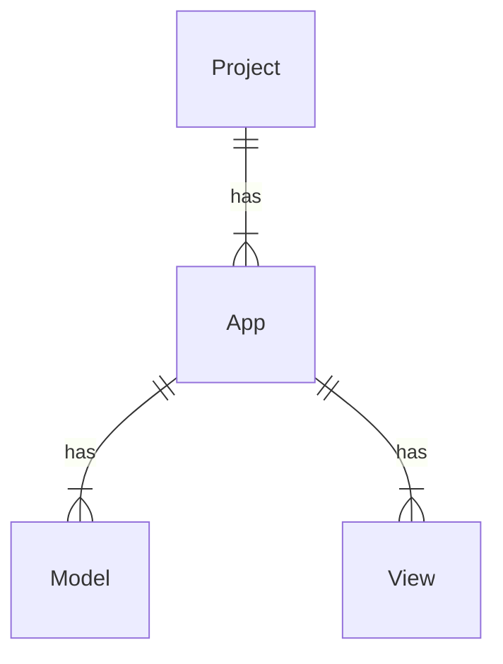

首先讓我們看看 Django 是怎麼定義不同層級間的關係的：



### Apps (Components)

^6d2cd0

在上面的架構層級中，App 這個名詞可能會讓人有些疑問或誤解：「一個 App 通常不就是一個 project 嗎？怎麼一個 project 下埋會有多個 App？」因此這裡建議你可以將 Django 所定義的 App 想成是一個 **Component**，一個 component 通常會是一個完整的「功能模組」，比如一個電商網站 Project 裡可能會有一個專門負責與帳號相關的 component 叫 `account`；可能會有一個購物車的 component `cart`…… 等。

### Models

一個 Component 底下會有若干個與該 component 最密且相關的 Models，由於 Django 使用 ORM 架構，因此一個 model 就對應到一個 database 中的 relation，這些 models 雖然說與所屬的 component 最密切相關，但當然也是可以在其它 components 中被引入使用的。

### Views

另外，一個 component 底下也會有若干個與該 component 最密且相關的 Views，如果專案採用前後端混合（Server-Side Rendering），則一個 view 就對應到一個前端畫面；若專案只是一個 API server，那一個 view 就會對應到一個 API endpoint。

# 通用的專案資料夾結構

下面以一個叫做 `MyEcommerce` 的專案舉例:

```plaintext
MyEcommerce
├── .git
├── main
│   ├── account
│   |   ├── __init__.py
│   |   ├── admin.py
│   |   ├── apps.py
│   |   ├── models.py
│   |   ├── tests.py
│   |   ├── views.py
│   |   └── migrations
│   |       └── __init__.py
│   ├── __init__.py
│   ├── settings.py
│   ├── asgi.py
│   └── wsgi.py
├── .env
├── .gitignore
├── requirements.txt
└── manage.py
```

### Project 底下各個檔案的角色

^24b1b9

- `/manage.py`

    用來管理整個專案，搭配不同的參數執行此檔案可以做到 migrate database、啟動 dev server、新增 App 等動作。

- `/main/__init__.py`

    單純讓 `main` 這個 sub directory 成為一個 module，裡面通常不會有 code，然而專案的大部分程式，包含各個 Apps 都會在 `/main` 這個 module 中。

- `/main/setting.py`

    專案設定檔。

- `/main/urls.py`

    URL endpoints 以及 API endpoints。

### App (component) 底下各個檔案的角色

- `./__init__.py`

    #TODO 

- `./admin.py`

    #TODO 

- `./apps.py`

    #TODO 

- `./models.py`

    #TODO 

- `./tests.py`

    #TODO 

- `./views.py`

    #TODO 

- `./migrations`

#TODO 
