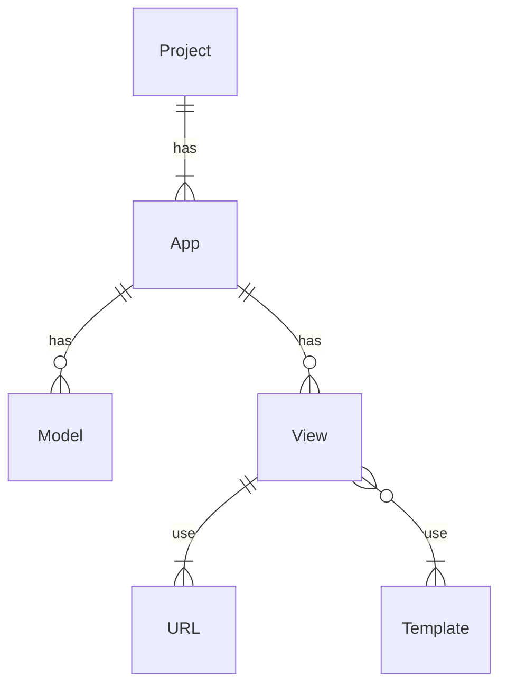

首先讓我們看看 Django 是怎麼定義不同層級間的關係的：



### Apps (Components)

在上面的架構層級中，app 這個名詞可能會讓人有些疑問或誤解：「一個 app 通常不就是一個 project 嗎？怎麼一個 project 下還會有多個 apps？」因此這裡建議你可以將 Django 所定義的 app 想成是一個 **component**，一個 component 通常會是一個完整的功能，比如一個電商網站裡可能會有一個專門負責與帳號相關的 component 叫 `account`；可能會有一個購物車的 component `cart`……等。

### Models

Model 即 data model，一個 app (component) 底下會有若干個與該其最密切相關的 models。

Django 使用 [[ORM.canvas|ORM]] 架構，因此原則上一個 model 就對應到一個 database 中的 relation，這些 models 雖然說與所屬的 app 最密切相關，但也可以在其它 app 中被 import 使用。

### Views

一個 app (component) 底下也會有若干個與該 app 最密切相關的 views，如果專案採用前後端混合的架構（[[SSR vs. CSR#Server-Side Rendering (SSR)|server-side rendering]]），則一個 view 就對應到一個網頁；若專案只是一個 API server，那一個 view 就會對應到一個 API endpoint。

### URLs

View 本身只是一個 function，必須額外定義「要透過哪個 URL 觸發執行哪個 view function」。

### Templates

Templates 就是前端網頁的模板，所以要當專案採用前後端混合的架構時才會有 templates，如果專案只是一個 API server 就不會有 templates。

Django 的 templates 使用的語言既不是 Python 也不是 HTML、CSS 或 JavaScript，但你很可能會在這個檔案中同時看到這四種語言出現。

一個 view function會將資料傳進 template，並將該 template 轉換成真正的 HTML、CSS、JavaScript，然後回傳給 client。在 template 中我們會將 view function 傳進來的資料鑲嵌在它須要出現的位置，或作為給 JavaScript 讀取的變數。

# 通用的專案資料夾結構

e.g.

```plaintext
<PROJECT_NAME>
├── .git
├── main
│   ├── core
│   |   ├── __init__.py
│   |   ├── admin.py
│   |   ├── apps.py
│   |   ├── models.py
│   |   ├── tests.py
│   |   ├── views.py
│   |   └── migrations
│   |       └── __init__.py
│   ├── <APP_NAME>
│   |   ├── __init__.py
│   |   ├── admin.py
│   |   ├── apps.py
│   |   ├── models.py
│   |   ├── tests.py
│   |   ├── urls.py
│   |   ├── views.py
│   |   └── migrations
│   |       └── __init__.py
│   ├── __init__.py
│   ├── settings.py
│   ├── asgi.py
│   ├── wsgi.py
│   └── urls.py
├── .env
├── .gitignore
├── README.md
├── requirements.txt
└── manage.py
```

### Project 底下各個檔案的角色

##### manage.py

用來管理整個專案，搭配不同的參數執行此檔案可以做到 migrate database、啟動 dev server、新增 app 等動作。

##### main/\_\_init\_\_.py

單純讓 main 這個 sub-directory 成為一個 module，裡面通常不會有 code，然而專案的大部分程式，包含各個 Apps 都會在 /main 這個 module 中。

##### main/setting.py

專案設定檔。

##### main/asgi.py

#TODO 

##### main/wsgi.py

#TODO 

##### main/urls.py

定義 URL (API) endpoints 以及它們要觸發的 view 的地方。比較常見的做法是在每個 app (component) 底下定義各自的 urls.py，再於 main/urls.py 中將他們引入，所以 main/urls.py 會長地像這樣：

```Python
from django.urls import include, re_path

urlpatterns = [
    re_path(r"^api/account/", include("main.app1.urls")),
    re_path(r"^api/stock/", include("main.app2.urls")),
    re_path(r"^api/memo/", include("main.app3.urls")),
]
```

##### main/core/

這個 app (component) 會包含一些公用的 abstract models, decorators 等。

### App (Component) 底下各個檔案的角色

##### ./\_\_init\_\_.py

#TODO 

##### ./admin.py

#TODO 

##### ./apps.py

#TODO 

##### ./models.py

與這個 app 相關的所有 models 會以 class 的形式被定義在這個檔案裡。

##### ./tests.py

#TODO 

##### ./views.py

與這個 app 相關的所有 views 會以 function 的形式被定義在這個檔案裡。

##### ./migrations

#TODO 
