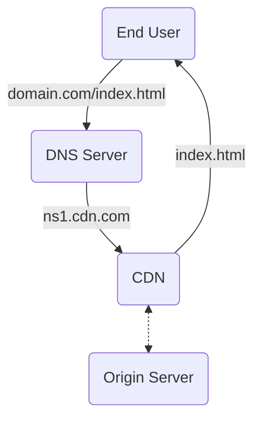

#Caching

CDN 為 Content Delivery/Distribution Network 的縮寫，是一種「可以儲存與提供檔案，並根據 client 位置、當下網路狀況、以及各種歷史數據來最小化檔案傳輸時間」的服務。

>[!Note]
>不只靜態檔案可以存在 CDN，很多網路服務也會將動態網頁儲存在 CDN 中。

# CDN 在網路服務中扮演的角色

### CDN 運作流程

當 CDN 無法在自己身上找到 end user 請求的資源時，才會向 origin server 請求資源。CDN 拿到資源後除了轉交給 end user 外，還會將該資源存放在自己身上，以直接提供給下一個 user。

### PoPs

CDN 供應商會將數百到數千個不等的 nodes 部署在全球各地，這些 nodes 又叫做 point of presences (PoPs) 或 edge servers，每個 PoP 都配有超大的儲存空間（HDD、SSD、RAM 都有）來儲存資料，扮演著如同 [reverse proxy](</System Design/Forward Proxy & Reverse Proxy.md#Reverse Proxy>) 的角色，提供資料 [Caching](</System Design/Caching.canvas>) 的服務。

### CDN 供應商

常見的 CDN 供應商包括 Amazon [[CloudFront]]、Cloudflare 等。

# 如何找到最近的 Edge Server？

有兩種找到最近的 edge server 的方法，分別是 DNS-based routing 與 anycast：

### DNS-Based Routing

每個 edge server 有自己專屬的 IP address，DNS server 根據 request 來源的地區將其中的 domain name 解析成最鄰近的 edge server 的 IP address。

### Anycast

所有 edge servers 共用同一個 IP address，所有 edge servers 都會收到 request，但只有最鄰近的那個（或者是最閒的那個）會回傳資料。

# 檔案最佳化

CDN 為了可以快速提供資料，除了要選對 server 的位置以外，有些 CDN 服務也會把檔案的大小極小化，比如將 JPG、PNG 等圖檔轉成 WEBP、AVIF 等格式，可以在保有原畫質的前提下大幅將檔案縮小；或者將 JavaScript 檔案 minify（刪除所有空格與換行）。

# 優點

### Client 感受到的檔案載入速度變快

因為 client 與 server 的距離變近，所以檔案傳輸時間變短。對服務供應者來說，這可以有效減少使用者因為缺乏耐心等待而離開網站的機率 (bounce rate)。

### 降低 Server 負擔

有了 CDN，end users 就不會直接向 origin server (content owner) 索取資料，可以降低 origin server 用於取得檔案的運算資源，以及為傳輸檔案所佔用的網路頻寬。

CDN 某種程度也可以用來防止 origin server 受到 DDoS 攻擊，因為對某些資源的請求會直接被 CDN 的 edge servers 處理掉，它們不容易被 DDoS 擊垮，尤其是使用 anycast 機制的 CDN 可以將大量的請求分散到各個 edge servers 上。

### Downtime 下降

CDN 有備援機制，當某個 edge server 故障時，CDN 服務會將請求轉導至其它鄰近地區的 server。

# 參考資料

- <https://en.wikipedia.org/wiki/Content_delivery_network>
- <https://www.imperva.com/learn/performance/what-is-cdn-how-it-works/>
- <https://www.youtube.com/watch?v=RI9np1LWzqw>
