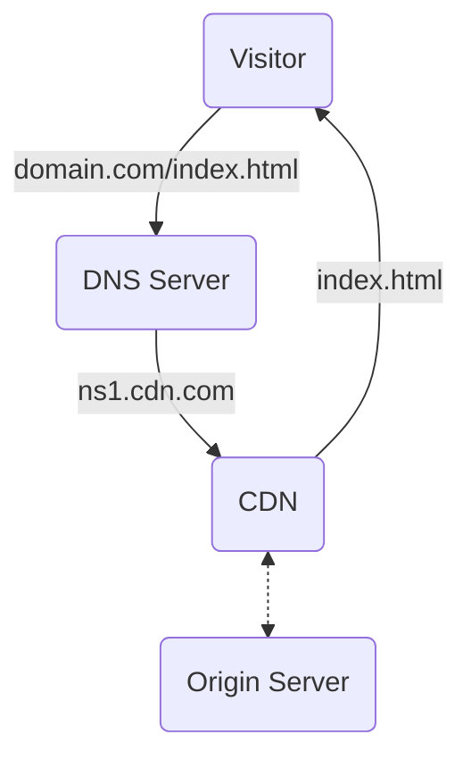

#Caching

CDN 為 Content Delivery/Distribution Network 的縮寫，是一種「可以根據當下網路狀況以及歷史數據來最佳化檔案於網際網路上的存放位置」的服務。針對靜態檔案，由於其內容不常改變，因此 CDN 可以將這些檔案 cache 住，以供下個 client 下個鄰近的 client 來取用。

下左圖為 single-server service 的示意圖，右圖則為使用 CDN 的 service 的示意圖：

![[cdn-vs-single-server-service.svg]]

CDN 流程圖：

CDN 是介於內容所有者 (Content Owner) 與 ISP (Internet Service Provider) 之間的一層服務，Content Owner 付錢給 CDN Vendor 以享有 CDN 的便利性，CDN Vendor 則須付錢給 ISP 以讓內容可以順利地傳遞給 end users。

CDN Vendor 並不是一家壟斷，有名的 vendors 包括 Amazon CloudFront、Cloudflare 等。

![[cloudfront-and-cloudflare.png]]

這些 CDN Vendors 會將數百到數萬個不等的 "nodes" 部署在全球各地（通常是人口密集的地方），這些 nodes 又叫做 point of presences (PoPs) 或 edge servers，他們扮演的角色其實說穿了就是 [[Forward Proxy 與 Reverse Proxy#Reverse Proxy|Reverse Proxy]]，每個 PoP 都配有超大的儲存空間（HDD, SSD, RAM 都有）來 cache 資料。

# 優點

### Client 的下載速度變快

因為 Client 與 Server 的距離變近，所以速度變快。

### Server 的負擔降低

由於 end users 現在不一定會直接向 Origin server 索取資料，因此使用 CDN 也可以幫助降低 Origin Server 的負擔。

### Server 更安全

CDN 可以用來預防 Origin Server 受到 DDoS 攻擊，因為現在 request 不是打向 Origin Server，而是 CDN 的 edge servers，這些 edge servers 不容易被 DDoS 擊垮。

### Downtime 下降

CDN 有異地備援機制，當某個 CDN 伺服器故障時，系統將會調用其他鄰近地區的伺服器服務。

# 如何將檔案透過 CDN 傳遞？

#TODO

# 參考資料

- <https://en.wikipedia.org/wiki/Content_delivery_network>
- <https://www.imperva.com/learn/performance/what-is-cdn-how-it-works/>
- <https://www.youtube.com/watch?v=RI9np1LWzqw>
