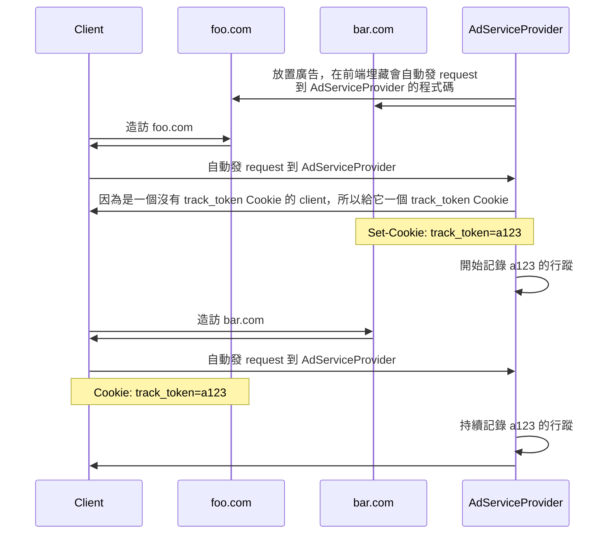

#Cookie

首先，沒有第二方 Cookies，所以這篇其實只有兩段。

# 第一方 (First-Party) Cookies

若 Cookie 的 `domain` attribute 與 client 所造訪的網頁的 domain（也就是網址列上顯示的網域）相同，那麼這個 cookie 就是 first-party cookies。

# 第三方 (Third-Party) Cookies

若一個 cookie 的 `domain` attribute 與 client 所造訪的網頁的 domain 不同，那麼這個 cookie 就是第三方 cookie，當 client 發出 Cross-Origin Request 時就會自動帶上 `domain` attribure 為目標網域的第三方 cookies。

第三方 cookies 常被廣告行銷公司用來追蹤使用者的瀏覽紀錄與瀏覽習慣，以圖示意如下：

只要 A 廣告行銷公司的第三方 cookies 存在 client-side，所有「讓 A 廣告行銷公司放置廣告的網站」就都有辦法幫忙搜集「這個 cookie 背後所代表的 client」在自己的網站上的行蹤，藉此獲得分潤。

# 參考資料

- <https://shubo.io/cookies/#cookie-%E6%98%AF%E4%BB%80%E9%BA%BC>
- <https://en.wikipedia.org/wiki/HTTP_cookie>
