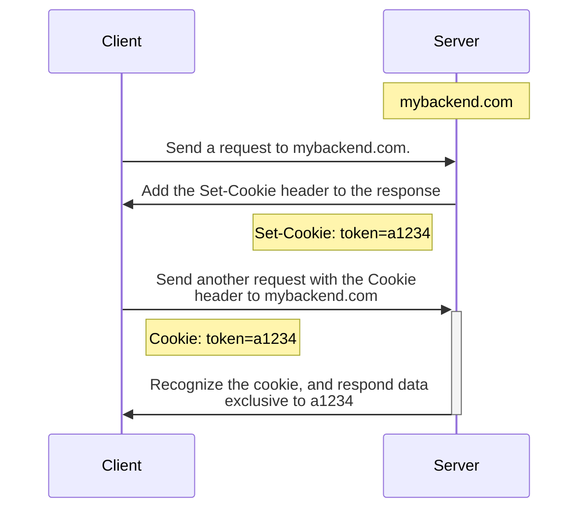

#WebDevBackend #WebDevFrontend #Cookie

Cookies 是 browser 儲存文字資料的其中一個地方（其它 browser 資料存儲方式之比較請看[[瀏覽器中的儲存空間.draft|這篇]]），`Cookie` header 則是 request 中的一個 header 欄位。

在 Chrome 中，可以透過 Developer Tools > Application > Cookies 觀察目前的 domain 底下的 cookies。

![[cookie-storage.png]]

# 如何設置 Cookies？

### 一、由 Server 設置

Cookie 可以由 server 透過 response 的 HTTP `Set-Cookie` Header 傳遞給 browser， browser 收到後會將 `Set-Cookie` 的 value 存進 Cookies，browser 會在之後與相同 server 溝通時，**自動** 將這些 cookies 放在 request 的 `Cookie` header。



如上圖所見，`Set-Cookie` header 長得像這樣：

```plaintext
Set-Cookie: <cookie-name>=<cookie-value>
```

而 `Cookie` header 則長得像這樣（多個 cookies 間以 `;` 隔開）：

```plaintext
Cookie: <cookie_1-name>=<cookie_1-value>;<cookie_2-name>=<cookie_2-value>
```

### 二、Client 自己設置

與 cookies 相關的 Web API 爲 `document.cookie`：

```JavaScript
document.cookie = "my_cookie=a1234"
```

上面的語法只會新增或修改 `my_cookie` 這個 cookie 的值，並不會把其它已存在的 cookies 清除。

# Cookie Attributes

設置 cookie 時，除了指定 name 與 value 外，還可以設定其它關於這個 cookie 的屬性，設置屬性的方法是直接寫在 `name=value` 後，並使用 `;` 區隔各個 attributes，舉例如下：

```plaintext
user=John; path=/; expires=Tue, 19 Jan 2038 03:14:07 GMT
```

cookie attributes 包含：

### `expires`

指定一個時間點，超過該時間點後，browser 會刪除此 cookie。

### `max-age`

指定一個時長，單位為秒，browser 收到 cookie 後開始倒數計時，時間到後刪除此 cookie。

若一個 cookie 既沒有 `expires` 也沒有 `max-age`，則該 cookie 會在使用者關閉瀏覽器後被刪除，這個性質與 [[瀏覽器中的儲存空間.draft|session storage]] 相似，因此又叫做 session cookie。

### `domain`

設置 domain 時，無論由 server 或 client，都只能設置為自己本身所處的 domain，或這個 domain 的 subdomain，比如，domain 為 foo.com 的 server 不能設置一個 `domain` 為 bar.com 的 cookie。

另外，若 domain 為 foo.com 的 server `Set-Cookie` 時沒有指定 domain，則 browser 會預設此 cookie 的 domain 為 server 的 domain（也就是 foo.com），不過在 **大部分** 的 browser 中，這樣的效果與 server **明文設定** `domain=foo.com` 會有些許不同，前者只會挾帶在 client 對 foo.com 發出的 requests，後者則會挾帶在 client 對 foo.com 以及 foo.com 的所有 subdomains（如 example.foo.com）發出的 requests。

### `path`

其扮演的角色與 `domain` 類似，若有指定 `path` 給 cookie，則 browser 只有在指定的 path 中可以存取這個 cookie，若沒有指定，則 browser 會將其預設為 `/`。

### `Secure`

設置 `Secure` attribute 的方式即直接加 `; Secure`（`Secure` 不是一個 name-value pair）。

設有 `Secure` attribute 的 cookie 只有在 client 與 server 間的溝通管道有被加密時（比如 https）才會被挾帶在 request 中，這可以使竊聽者以及惡意的 proxy server 無法解讀竊聽到的 cookies 內容。

然而，若在 server 傳送具有 `Set-Cookie` header 的 response 時沒有透過加密管道，則即使是 set 一個具有 `Secure` attribute 的 cookie，還是可以在這個 response 中擷取到明文的 cookie 內容

### `HttpOnly`

設置 `HttpOnly` attribute 的方式即直接加 `; HttpOnly`（`HttpOnly` 不是一個 name-value pair）。

設有 `HttpOnly` attribute 的 cookie，無法[[#在 Client-Side 讀取與刪除 Cookies|在 client-side 使用 JavaScript 存取]]，這些 cookies 只能被用在 http 或 https 的 requests 中。`HttpOnly` 可以防止有心人士「在 client side 植入讀取 cookies 的 JavaScript 來讀取你在其它網站上的重要 token」（這類型的攻擊叫做 [[CSRF Attack & XSS Attack#XSS Attack|Cross-Site Scripting Attack (XSS Attack)]]）。

>具有 `HttpOnly` attribute 的 cookie 只能透過 server 設置，JavaScript API 不會讓自己有能力製造一個自己之後無法存取的 cookie。

### `SameSite`

`SameSite` 有三種值可選，分別是：Strict、Lax 與 None：

- Strict

    當 cookie 的 `SameSite=Strict` 時，這個 cookie 只有在「request url 的 domain 等於 origin（也就是 client side 自己）的 domain」時可以被挾帶在 request 中，換句話說，`SameSite=Strict` 的 cookies 一定是[[第一方 Cookies & 第三方 Cookies#第一方 (First-Party) Cookies|第一方 cookie]]。

- Lax

    相較於 Strict，Lax 相對寬鬆，若在 A 網域對 B 網域發 GET request，`SameSite=Lax` 的 cookies 是可以被攜帶的，其它 HTTP method 的 request 則不會攜帶這些 cookies。

- None

    在 A 網域對 B 網域的 server 發任何 HTTP method 的 request，browser 都會自動帶上 `domain=B; SameSite=None` 的所有 cookies。

[[第一方 Cookies & 第三方 Cookies#第三方 (Third-Party) Cookies|第三方 cookies]] 的必要條件是它的 `SameSite` attribute 須為 None 或 Lax，換句話說就是要可以被 cross-origin request 攜帶。

若某個網站[[Authentication - Cookie-Based vs. Token-Based|用來驗證身份的  token]] 也可以被 cross-origin request 攜帶，那麼在 A 網域往 B 網域發送的 requests 就可以通過 B 網站的身份驗證機制，如果 B 網站又沒有檢查 request 的 `Referer` header，就會不疑有他地去執行 requests（比如從你的銀行帳號轉帳到其他人的戶頭），這個行為稱為 [[CSRF Attack & XSS Attack#CSRF Attack|CSRF]]，而防止 CSRF attack 的方式就是將 authentication cookie 的 `SameSite` 設為 Strict。

>[!Note]
>如果前端與後端在不同的網域，那就沒辦法透過 response 設定一個 `SameSite` 為 Strict 或 Lax 的 cookie，所以如果網站的前後端所在的網域不同，那最好是不要使用 cookie-based authentication。

# 在 Client-Side 讀取與刪除 Cookies

### get

```TypeScript
function getCookie(key: string): string | null {
    const divider = key + "=";
    const decodedCookie = decodeURIComponent(document.cookie);
    const cookies = decodedCookie.split(";");

    for (let i = 0; i < cookies.length; i++) {
        let c = cookies[i];
        while (c.charAt(0) === " ") c = c.substring(1);
        if (c.indexOf(divider) === 0) {
            return c.substring(divider.length, c.length);
        }
    }

    return null;
}
```

下面示範如何結合上面的 `getCookie` function，將 cookie `my_cookie` 的值塞入自訂的 request header `My-header` 中，最後送出 request：

```TypeScript
const header = new Headers();
header.append("My-header", getCookie("my_cookie"));

const options: RequestInit = {
    method: "GET",
    headers: header,
    credentials: "include",
};

fetch("https://mybackend.com/api/endpoint>", options).then(
    // ...
);
```

### delete

```TypeScript
function deleteCookie(key: string): void {
    if (getCookie(key)) {
        const d = new Date();
        d.setTime(d.getTime() - 10);
        document.cookie = `${key}=;expires=${d.toUTCString()};path=/`;
    } else throw Error("Cookie Not Found");
}
```

# 參考資料

- <https://shubo.io/cookies/#cookie-%E6%98%AF%E4%BB%80%E9%BA%BC>
- <https://en.wikipedia.org/wiki/HTTP_cookie>
- <https://www.w3schools.com/js/js_cookies.asp>
- <https://stackoverflow.com/questions/61555100/cookie-in-set-cookie-header-not-being-set>
