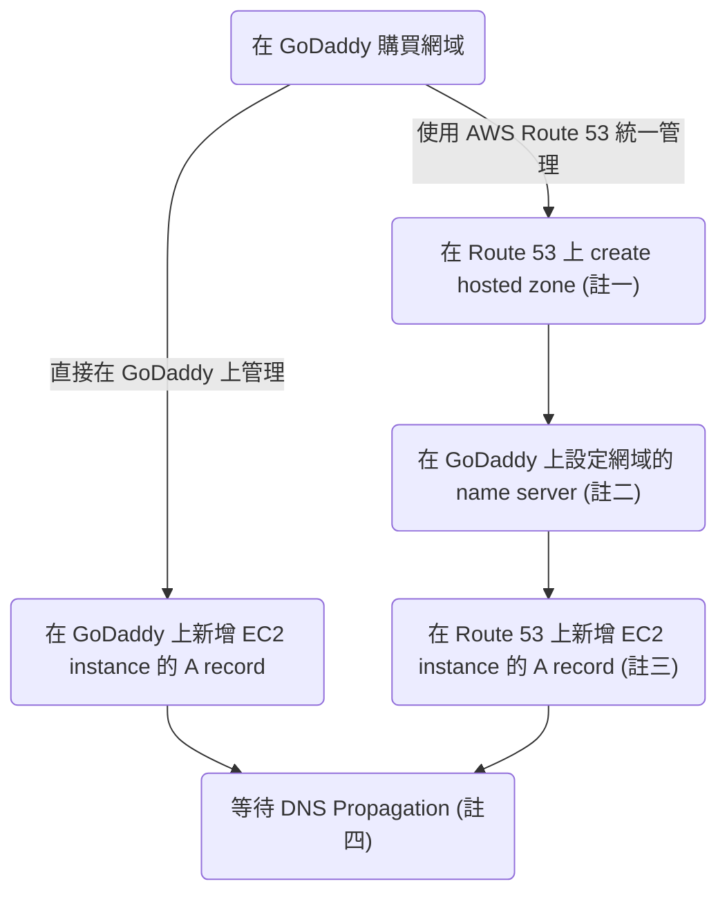

#AWS #WebDevPractice 

### 流程

- 註一：輸入剛剛購買的 domain name，成功建立後會出現一個 NS record
- 註二：把 name server 的網址改成剛剛出現在 Route 53 的 NS record 中的 values（應該會有 4 個值）
- 註三：Value 填 EC2 instance 的 public IP address。
- 註四：最多會須要等兩天，但通常不用這麼久。

### 什麼時候須要使用 AWS Route 53 來統一管理？

- Route 53 是一個 AWS 提供的「集中管理 DNS」的服務，當你有很多 domain names 跟 IP addresses 要管理時，才會需要考慮使用它，否則通常直接在網路託管商上面設定 records 就可以了
- Route 53 要錢
