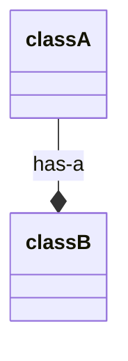

#OOP

從字面上來解釋，composition 的意思是「組成」；在程式語言中，object composition 透過在 class A 裡定義一個類別為 class B 的 instance variable，使得 objects 之間產生 "has-a" 的關係：



比如下面這個例子，就可以說 "a `Person` has a `Job`"：

```TypeScript
class Job {
    // ...
}

class Person {
    private job: Job;
    // ...
}
```

# Composition over Inheritance

==Object composition 與 [[OOP 四本柱#繼承 (Inheritance)|inheritance]] 的目的都是提高 code reusability==，但 inheritance 會增加程式碼間的耦合度，使得彼此的擴充性互相牽制，應謹慎使用，反觀 object composition 則不會有這個問題。

### 以咖啡機為例

一台全自動咖啡機的工作包含研磨咖啡豆、煮熱水，以及用熱水沖煮咖啡，使用 inheritance 的示範如下：

```TypeScript
class Grinder {
    public constructor() {/*...*/}
    public grind() {/*...*/}
}
class CoffeeMachine extends Grinder{
    public constructor() {/*...*/}
    public makeCoffee() {
        this.grind();
        this.heatWater();
        this.brew();
    }
    private heatWater() {/*...*/}
    private brew() {/*...*/}
}
```

上面這個例子中，`CoffeeMachine` 繼承了 `Grinder`，然後自己實作了 `Grinder` 沒有的 `makeCoffee`、`heatWater`，與 `brew` 三個 methods。

使用 object composition 的示範如下：

```TypeScript
class Grinder {
    public constructor() {/*...*/}
    public grind() {/*...*/}
}
class WaterHeater {
    public constructor() {/*...*/}
    public heatWater() {/*...*/}
}
class CoffeeMachine {
    private grinder: Grinder;
    private waterHeater: WaterHeater;
    public constructor() {
        this.grinder = new Grinder();
        this.waterHeater = new WaterHeater();
        // ...
    }
    public makeCoffee() {
        this.grinder.grind();
        this.waterHeater.heatWater();
        this.brew();
    }
    private brew() {/*...*/}
}
```

在 object composition 的例子中有 `Grinder`、`WaterHeater`、`CoffeeMachine` 三個 classes，其中 `CoffeeMachine` 有 `grinder` 與 `waterHeater` 兩個 properties，並且自己實作了 `brew` method。

為什麼前面說 inheritance 會增加耦合度呢？試想如果今天 `Grinder` 有一個 method `prepare`，並且在 `grind` 裡會先呼叫 `prepare` 為磨豆做準備，後來 `CoffeeMachine` 也想要有自己的 `prepare`，除了為磨豆做準備外也要為熱水作準備，但因為 `CoffeeMachine` 繼承的 `Grinder` 已經有 `prepare` 了，所以須要 override：

```TypeScript
class Grinder {
    public constructor() {/*...*/}
    public grind() {
        this.prepare();
        // ...
    }
    public prepare() {
        console.log("prepare for grinding");
    }
}
class CoffeeMachine extends Grinder{
    public constructor() {/*...*/}
    public makeCoffee() {
        this.grind();
        this.heatWater();
        this.brew();
    }
    private heatWater() {/*...*/}
    private brew() {/*...*/}
    public override prepare() {
        console.log("prepare for grinding");
        console.log("prepare for heating");
    }
}
```

你有沒有感覺上面這個寫法哪裡怪怪的？`CoffeeMachine` 在 `makeCoffee` 時須要呼叫 `prepare`，但卻不直接寫在 `makeCoffee` 裡，而是透過 `grind` 來呼叫（因為如果又在 `makeCoffee` 裡呼叫一次，總共就呼叫了兩次），重點是 `prepare` 裡包含了一個完全與 `grind` 無關的 "prepare for heating"…

那如果改用 composition 的方式寫呢：

```TypeScript
class Grinder {
    public constructor() {/*...*/}
    public grind() {
        this.prepare();
        // ...
    }
    public prepare() {
        console.log("prepare for grinding");
    }
}
class WaterHeater {
    public constructor() {/*...*/}
    public heatWater() {
        this.prepare();
        // ...
    }
    public prepare() {
        console.log("prepare for heating");
    }
}
class CoffeeMachine {
    private grinder: Grinder;
    private waterHeater: WaterHeater;
    public constructor() {
        this.grinder = new Grinder();
        this.waterHeater = new WaterHeater();
        // ...
    }
    public makeCoffee() {
        this.grinder.grind();
        this.waterHeater.heatWater();
        this.brew();
    }
    private brew() {/*...*/}
}
```

雖然這樣仍然沒有在 `makeCoffee` 裡直接呼叫 `prepare`，或者應該說 `CoffeeMachine` 根本就沒有 `prepare` 這個 method，但那也無妨，因為取而代之是 `WatherHeater` 自己有自己的 `prepare`，各零件完成自己的準備工作，或許這也更符合機器實際的運作情形。
# 參考資料

- <https://www.digitalocean.com/community/tutorials/composition-vs-inheritance>
