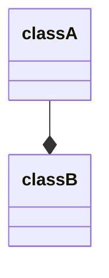

#OOP

從字面上來解釋，composition 的意思是將各種物件「組合」成一個新的物件；在程式語言中，object composition 透過在 class A 裡定義一個類別為 class B 的 instance variable，使得 objects 之間產生 "has-a" 的關係：



比如下面這個例子，就可以說 `Person` has a `Job`：

```TypeScript
class Job {
    // ...
}

class Person {
    private job: Job;
    // ...
}
```

# Composition over Inheritance

Object composition 與 inheritance 的目的都是提高 code reusability：

- **Inheritance**

    Superclass 中的 methods 可以在 subclass 中直接被呼叫，還可以在 subclass 中被 [[OOP 四本柱#Override vs. Overload|override]]，但是可能 superclass 中有某些 methods 是 subclass 用不到或用了會壞掉的。

- **Composition**

    #TODO 

# 參考資料

- <https://www.digitalocean.com/community/tutorials/composition-vs-inheritance>
