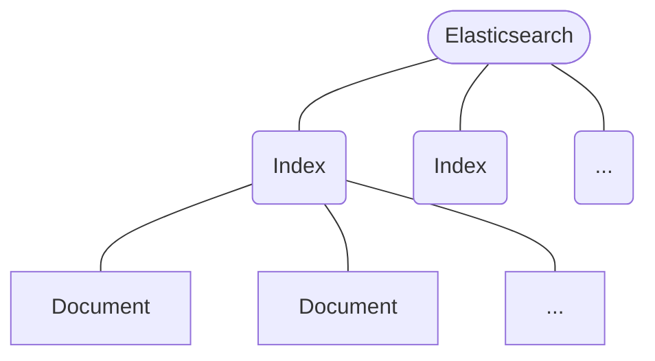

# 學習資源

- [GitHub 01](https://github.com/LisaHJung/Beginners-Crash-Course-to-Elastic-Stack-Series-Table-of-Contents)
- [GitHub 02](https://github.com/LisaHJung/beginners-guide-to-creating-a-full-stack-Javascript-app-with-Elasticsearch)
- [YouTube - season1](https://www.youtube.com/playlist?list=PL_mJOmq4zsHZYAyK606y7wjQtC0aoE6Es)
- [YouTube - season2](https://www.youtube.com/playlist?list=PL_mJOmq4zsHbcdoeAwNWuhEWwDARMMBta)

# The Elastic Stack

![[elastic-stack.png]]

### Elasticsearch 是 Elastic Stack 的核心

- 是一個提供 **Full-Text Search**（全文搜尋）功能的服務
- 建構在 **Apache Lucene** 之上，兩個都是用 **Java** 寫的
- 使用 [[HTTP]] 做為 application Layer，並且使用 [[REST API]]（詳見[[#溝通方式|此段]]）
- 接收 **JSON** 格式的 requests，大多時候也回傳 JSON 格式的 responses（很像在用 NoSQL）
- 給定搜尋條件，可以找出與這些條件「相關」的資料並依相關性排序，不一定要完全相符才找得到（詳見 [[CH4 - Search in Elasticsearch]]）

# Elasticsearch 核心概念



>如果把 Elasticsearch 類比成 relational database 的話，一個 document 就像是一張表中的一個 row；一個 index 就像是一個 table。

>[!Note]
>其實在 Elasticsearch 7.0 前，index 與 document 中間還有一層 **Type**（一個 index 底下可以有若干個 types，type 之下才是 documents），但自從 Elasticsearch 6.0 後，一個 index 底下只能有一個 type，而在 Elasticsearch 7.0 以後，就已經移除 type 這個概念了。

### Document

- 一個 document 會有若干個 **fields**，以 **JSON** (key-value pairs) 格式呈現
- Document 是 indexing 以及 searching 的最小單位，一個 document 就是一筆資料
- 每個 document 都有一個 unique ID（可以手動給或自動生成）

### Index

- Index 的全名叫 **Inverted Index**
- Index 會有名字，比如 product, news 或 student

# Scalability

### Cluster

一個 Cluster 裡會有若干個 **nodes**（一個 node 就是一台 server），每個 cluster 會有一個 unique name 可以透過設定檔設定（預設叫 "elasticsearch"）。

![[elastic-cluster-and-nodes.png]]

### Shard

一個 index 可以被分割成多個 shards，然後分散在不同的 nodes 上，會有一個 hash function 用來決定每個 document 該去哪個 shard。

將一個 index 分散到多個 nodes（多個 shards）上的好處包含：

- 不同 nodes 間可以平行運算，進而縮短搜尋時間
- 可以儲存更多資料

Shard 可以細分為 **Primary Shard** 與 **Replica**，每個 primary shard 都會有若干個 replicas（預設是 1 個），primary shard 可以寫入與讀取，replica 只能讀取。

Replica 一方面可以提高服務對於 search requests 的吞吐量，也可以用來備援，也因為 replica 的其中一個功能是備援，所以一個 primary shard 與它的 replicas 一定不會放在同一個 node 上，不然若 node 掛了，replica 也無法發揮作用。

下圖為 cluster, node, index 與 shard 的關係示意圖：

![[cluster-node-index-shard.png]]

>[!Note]
>Primary shard 的數量必須在建置 Elasticsearch Cluster 的一開始就決定，且==不能修改==，若真的要增加或減少 primary shard，就只能重新建一個 cluster。

# 溝通方式

Elasticsearch 透過 [[HTTP]] 傳送，且使用的是 [[REST API]]，預設使用 port 9200。

###### `curl` Request Pattern

```sh
curl -X <REST_VERB> <NODE>:<PORT>/<INDEX>[/<TYPE>[/<ID>]] [<OPTION> ...]
```

e.g.

```bash
curl -X GET http://localhost:9200/person/employee/123

curl -X PUT http://localhost:9200/ecommerce -d '{...}'
```

>[!Note]
>需要對 Elastic server 進行一些設定才能在 local 使用 curl 呼叫 local 的 Elasticsearch API，詳見 [[CH2 - 在本機建立 Elastic Service#Security]]。

# 參考資料

- <https://dev.to/lisahjung/beginner-s-guide-to-elasticsearch-4j2k>
- <https://www.youtube.com/watch?v=gS_nHTWZEJ8>
