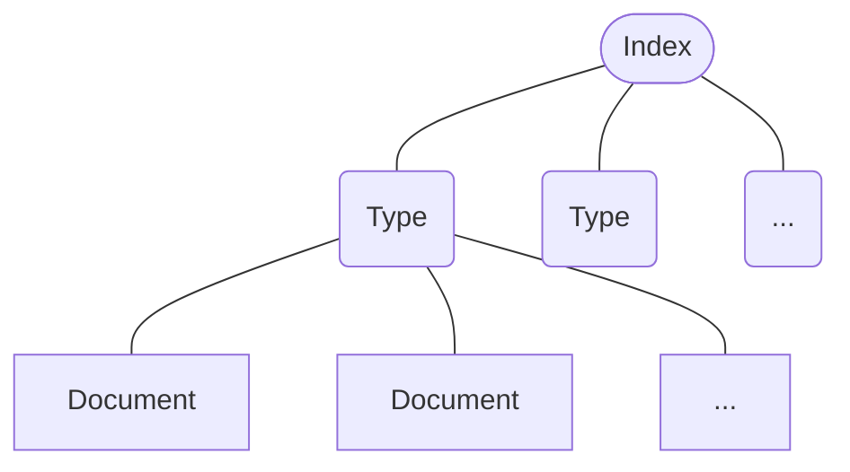

# 簡介

- 是一個提供 **Full Text Search**（全文搜尋）功能的服務
- 建構在 **Apache Lucene** 之上，兩個都是用 **JAVA** 寫的
- Application Layer 使用 **[[HTTP]]**，並且使用 **RESTful API**（詳見[[#溝通方式|此段]]）
- 接收 **JSON** 格式的 requests，回傳 JSON 格式的 responses（很像在與 NoSQL Database 溝通）

# 安裝與執行

### Step1: [安裝 Java](https://www.java.com/en/download/)

由於 Elasticsearch 建構在 Apache Lucene 之上，而 Apache Lucene 是用 Java 寫的，因此要運行 Elasticsearch 就必須先安裝 Java。

### Step2: [下載 Elasticsearch](https://www.elastic.co/downloads/elasticsearch)

下載的是壓縮檔，解壓縮後會得到一個名為 `elasticsearch-<VERSION>` 的資料夾。

### Step3: 執行

執行解壓縮後的資料夾中的 elasticsearch 執行檔，路徑為 bin/elasticsearch。

# 核心概念



>如果把 Elasticsearch 類比成 relational database 的話，一個 **document** 就像是一張表中的一個 row；一個 **type** 就像是一個 table；一個 **index** 就像是一個 database。

### Document & Field

一個 document 會有若干個 fields，以 JSON (key-value pairs) 格式呈現。

Document 是 indexing 以及 searching 的最小單位（一個 document 就是一筆資料）。

每個 document 有其所屬的 type，以及一個 unique ID（ID 可以手動給或者請 Elasticsearch 自動生成）。

### Type & Mapping

所有相同類型的 documents 集合成一個 type，每個 type 都有自己的 mapping，mapping 定義了一個 document 的每個 field 分別要是什麼資料型態，就像是 relational database 中一個 table 的 schema。

Mapping 也會定義一個 type 中的 documents 應該如何被 index，以及要用什麼資料結構儲存。

### Index

Index 的全名叫 **Inverted Index**，是搜尋的標的，一個 index 中包含若干個 types，如果要在多個 types 間搜尋，則這些 types 必須在同一個 index 內。

# Scalability

### Cluster

一個 Cluster 裡會有若干個 nodes（一個 node 就是一台 server），每個 cluster 會有一個 unique name（預設叫 "elasticsearch"）。

### Shard

一個 Elasticsearch Index 可以被分割成多個 Shards 然後分散在不同的 nodes 上，會有一個 hash function 用來決定每個 document 該去哪個 shard。

Shard 可以細分為 **Primary Shard** 與 **Replica**，每個 primary shard 都會有若干個 replicas（預設是 1 個），primary shard 可以寫入與讀取，replica 只能讀取。

Replica 一方面可以提高服務對於 search requests 的吞吐量，也可以用來備援，也因為 replica 的其中一個功能是備援，所以一個 primary shard 與它的 replicas 一定不會放在同一個 node 上，不然若 node 掛了，replica 也無法發揮作用。

>[!Note]
>Primary shard 的數量必須在建置 Elasticsearch Cluster 的一開始就決定，且==不能修改==，若真的要增加或減少 primary shard，就只能重新建一個 cluster。

# 溝通方式

Elasticsearch 透過 HTTP 傳送，且使用的是 [[REST API]]，預設使用 port 9200。

以下是使用 `curl` 發起 request 的 pattern：

```bash
curl -X<REST_VERB> <NODE>:<PORT>/<INDEX>/<TYPE>[/<ID>]
```

e.g.

```bash
# Get a document
curl -XGET http://localhost:9200/person/employee/123

# Create an index
curl -XPUT http://localhost:9200/ecommerce -d '{...}'

# Delete an index
curl -XDELETE http://localhost:9200/ecommerce

# Update a document
curl -XPOST http://localhost:9200/person/employee/123/_update -d '{...}'

# Delete a document by id
curl -XDELETE http://localhost:9200/person/employee/123

# List all indices
curl -XGET http://localhost:9200/_cat/indices?v
```

# Scoring

每送出一個 query，Elasticsearch 都會為所有 document 算出一個「與這個 query 的相關性」的分數，並以分數高低進行排序

### Query Context and Filter Context

Query Context 中的 query 才會影響上述的「分數」，filter context 中的 query 不會影響分數，而是直接將不符合的 document 濾掉。

### TF-IDF

TF-IDF 是用來衡量「在給定若干個 documents 中，一個 term 在一個 document 中的重要程度」的指標

$$
Term Frequency * Inverse Document Frequency
$$

其中 Term Frequency 代表一個 term 在一個 document 中出現的頻率；Document Frequency 則代表一個 term 在各個 documents 中出現的頻率。

# Searching

搜尋 documents 的方法主要有兩種：query string 以及 query DSL：

### Query String

e.g.

```bash
curl -XGET http://localhost:9200/person/employee/_search?q=Amy
```

- 可以使用 `*` 作為 wildcard

- 可以使用 `<FIELD>:<VALUE>` 的方式指定要搜尋的 field

    e.g. `q=name:Amy`

- 可以使用邏輯運算子

    e.g. `q=name:(Amy OR Bob)`, `q=(name:Amy AND gender:female)`

- 可以使用 `""` 指定 query string 中各個 word 的出現順序

    e.g. `q="Amy Chen"` 代表 document 中一定要出現 Amy 與 Chen，且 Amy 一定要先出現，==否則就會直接被篩掉==

Example searching result:

```JSON
{
    "took": 19,
    "timed_out": false,
    "_shards": {
        "total": 5,
        "successful": 5,
        "failed": 0
    },
    "hits": {
        "total": 1000,
        "max_score": 1,
        "hits": [
            "index": "person",
            "type": "employee",
            "_score": 1,
            "_source": {  // This is the document
                "name": "Amy",
                ...
            },
            ...
        ]
    }
}
```

### Query DSL

e.g.

```bash
curl -XGET http://localhost:9200/person/employee/_search
{
    "query": {
        "match": {
            "name": "Amy"
        }
    }
}
```

### DSL Query 的種類

- **Leaf Query and Compound Query**

    以上面的例子來說，`"name": "Amy"` 是 leaf query；compound query 則是由多個 leaf queries 組成。

- **Full-Text Query**

    用來比對文字

- **Term-Level Query**

    用來精準比對數字

- **GEO Query**

# 零碎筆記

- Elasticsearch 中沒有 array 這種型別

# 參考資料

- <https://www.youtube.com/watch?v=C3tlMqaNSaI>
- <https://www.youtube.com/watch?v=ksTTlXNLick>
