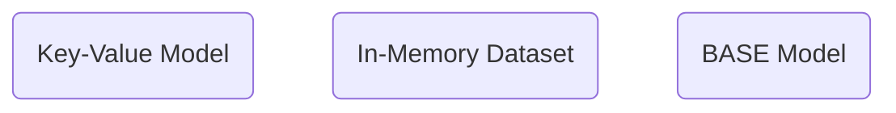

# 特色



### Key-Value Model

Redis 屬於 NoSQL。

### In-Memory Dataset

- 優點：存取速度快
- 缺點：Volatile（不適合作為 Single Source of Truth）

### BASE Model

對於 Redis 來說，[[CAP Theorem|Availability 比 Consistency 來得重要]]，故屬於 BASE Model。

# 基本操作

### 數字會被轉為字串

```plaintext
127.0.0.1:6379> set age 20
OK
127.0.0.1:6379> get age
"20"
127.0.0.1:6379>
```

### 可以設置資料的有效期限

使用 `expire <key> <seconds>` 為一個已存在的 key 設定有效期限：

```plaintext
127.0.0.1:6379> expire age 120
(integer) 1
127.0.0.1:6379>
```

回傳 `(integer) 1` 代表設置成功。

---

使用 `ttl <key>` 查詢再多久過期：

```plaintext
127.0.0.1:6379> ttl age
(integer) 114
127.0.0.1:6379> ttl age
(integer) -2
```

回傳 `(integer) -2` 代表該 key 已過期。

---

使用 `setex <key> <second> <value>` 設置一個具有有效期限的新 key-value pair：

```plaintext
127.0.0.1:6379> setex age 120 21
OK
127.0.0.1:6379>
```

### 支援多種複雜的資料型態

**List**

支援 "left push", "left pop", "right push", "right pop"，故可以實現 Queue, Stack 等資料結構，示範如下：

```plaintext
127.0.0.1:6379> rpush names Alic Bob
(integer) 2
127.0.0.1:6379> lrange names 0 -1
1) "Bob"
2) "Alic"
127.0.0.1:6379>
```

**Set**

e.g.

```plaintext
127.0.0.1:6379> sadd words 1 2 2
(integer) 2
127.0.0.1:6379> smembers words
1) "1"
2) "2"
127.0.0.1:6379>
```

**Hash**

以 key-value pair 做為某個 key 的 value，但最多就這兩層，無法繼續將 Hash 中的某個 key 的 value 設為 Hash，示範如下：

```plaintext
127.0.0.1:6379> hset person name Alice
(integer) 1
127.0.0.1:6379> hget person name
"Alice"
```

# 參考資料

- <https://redis.io/docs/>
- <https://blog.techbridge.cc/2016/06/18/redis-introduction/>
- <https://www.youtube.com/watch?v=jgpVdJB2sKQ>
