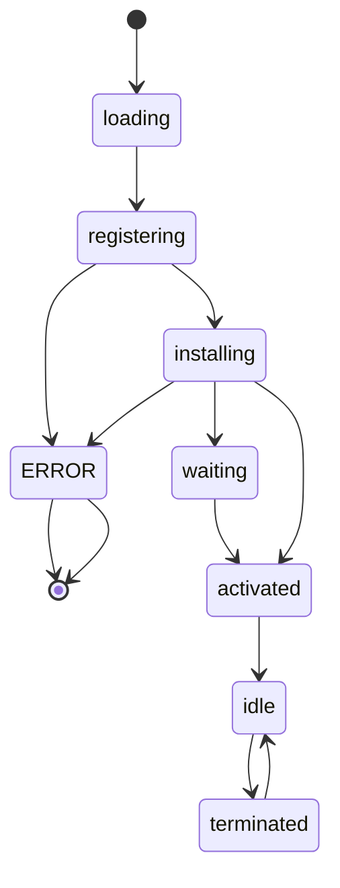

#Caching 

# Service Worker 的生命週期



# Service-Worker Cache

^1a979e

### 什麼時候觸發 Caching Mechanism

觸發 Caching 機制的時機點主要包括以下幾種可供選擇：

- **On Install - As a Dependency**
	
	![[On Install - As a Dependency.png]]

- **On Install - Not As a Dependency**
	
	![[On Install - Not As a Dependency.png]]

- **On Activate**
	
	![[On Activate.png]]

- **On User Interaction**
	
	![[On User Interaction.png]]

### Caching Strategies

Caching Strategies 即「使用 Cache 的策略」，白話一點就是「要不要使用 Cache」以及「什麼情況下要使用 Cache」，常見的 Caching Strategies 有：

- **Cache Only**
	
	![[Cache Only.png]]

- **Network Only**
	
	![[Network Only.png]]
	
>從 network 取來的資料也可以存進 cache 中，如下圖：
>
>![[On Network Response.png]]

- **Cache Falling Back to Network**
	
	![[Cache Falling Back to Network.png]]
	
>如果 network 也沒有回應，那可以顯示預設畫面，下圖的步驟 4 指的就是顯示預設畫面，比如 404 頁面或 offline 提示。
>
>![[Generic Fallback.png]]

- **Network Falling Back to Cache**
	
	![[Network Falling Back to Cache.png]]

- **Stale-While-Revalidate**
	
	Revalidate 指的就是下圖中第 4 步「向 network 索取真實資料」的動作。
	
	在 [[SSR vs. CSR#^2937c3|CSR]] 的架構中，從 network 取得真實資料後，必須重新渲染畫面才能讓使用者看到最新的資料，否則就算新資料來了，也只是更新 cache 而已，user 要等到下次送出相同的 request 時才看得到（但那時很可能又有更新的資料）。
	
	![[Stale-While-Revalidate.png]]

- **Cache and Network Race**
	
	![[Cache and Network Race.png]]

# 使用 Message 與 DOM 溝通

Service Worker 無法直接控制 DOM，以 React 為例，Service Worker 無法與 component 溝通，也無法呼叫 Redux actions。

實作 Stale-While-Revalidate 時最有可能須要與 DOM 溝通，因為當最新資料從 network 送來時，畫面通常會須要渲染出這些最新的資料，此時 service worker 只能使用 `postMessage` 發出通知，各個 components 必須自己監聽 message，收到 message 後自己更改 state：

**service-worker.ts**

```typescript
const channel = new BroadcastChannel("some-name");

self.addEventListener("fetch", (event) => {
	event.respondWith(
		caches.open("some-name").then((cache) => {
			return cache.match(event.request).then((response) => {
				const fetch_promise = fetch(event.request).then(
					(network_response) => {
						// ...
						network_response.json().then((data) => {
							// Post Message
							channel.postMessage({data});
						});
						return network_response;
					}
				);
				return response || fetch_promise;
			});
		})
	);
});
```

**MyComponent.tsx**

```typescript
class Main extends React.Component<Props, State> {
	private channel: BroadcastChannel;
	// ...
	this.channel = new BroadcastChannel("some-name");
	this.channel.addEventListener(
		"message",
		(e: MessageEvent<{data:any}>) => {
			// Do something when receive message
		}
	)
}
```

# 必須使用 HTTPS

Service Worker 除了在 localhost 時，可以在未加密的 `http` protocol 中運作以外，其他情況下都只有在 `https` 中才能運作。

會有這個規定是因為 Service Worker 既可以攔截 requests 又可以偽裝成真的 response，在沒有 https 這種安全的管道時，我們並無法辨認上述動作是 Service Worker 做的還是其實是 man-in-the-middle attack。

# 訊息推播

![[On Push Message.png]]

# Background Syncing

Background Syncing 使得即使 user 將 browser 關閉，web app 還是可以在背景向 network 要資料並更新 cache。

![[On Background-Sync.png]]

# Service Worker-Side Templating

![[Service Worker-Side Templating.png]]

# 更新 Service Worker

每次造訪有 service worker 的網頁時都會下載最新的 service worker 檔案，只要新下載的 service worker 與原本的有任何不同，browser 就會將其 register 並 install，但由於舊版的 service worker 還存在，因此新的 service worker 會進入 `waiting` 狀態，直到 user 將目前 browser 的所有「相同網站」的 tabs 都關掉後，下次再造訪時才會讓 service worker 進入 `activated` 狀態。

為什麼不在發現新下載的 service worker 與原本的不同時就將舊的捨棄然後讓新的進入 `activated` 狀態呢？這是因為 browser 要避免「同一個網頁在不同 tabs 中使用著不同的 service worker」這個狀況，因為不同版本的 service worker 往 browser 存的資料的格式可能不同（不相容）。

# 參考資料

- https://web.dev/service-worker-caching-and-http-caching/

- https://web.dev/offline-cookbook

- https://developer.chrome.com/docs/workbox/

- https://ithelp.ithome.com.tw/articles/10276666

- https://blog.sessionstack.com/how-javascript-works-service-workers-their-life-cycle-and-use-cases-52b19ad98b58