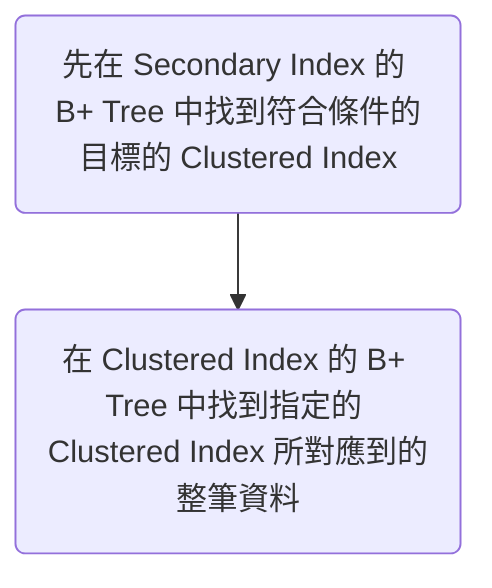

# Introduction

---

### Indexing 的目的

加快 `WHERE`, `GROUP BY`, `ORDER BY` 等子句中出現某 column 時的 query 速度。

### 為什麼 Indexing 可以加速

索引會被存在一種特殊的資料結構中（通常是 [[從 Binary Search 到 B+ Tree#^88367d|B+ Tree]] 或 [[從 Binary Search 到 B+ Tree#^7c9507|B Tree]]）。

1. B+ Tree 使得進行查尋／新增／刪除資料時的時間複雜度皆為 O(log(n))，相比而言，Full Table Scan 為 O(n)
	
	- **以「沒有被 Index」的欄位搜尋：Full Table Scan**
		
		![[20089358AbjWkzPWEE.png]]
	
	- **以「有被 Index」的欄位搜尋**
		
		![[20089358vwxjbLWVnq.png]]

2. B+ Tree 中的所有 internal nodes 都只存 index 本身，不會存該 index 所對應到的整筆資料，所以在 B+ Tree 中 traverse 不會像 Full Table Scan 一樣須要讀入其他欄位的資料

3. 被選擇的資料須要排序時，可以直接使用 B+ Tree 中的 external nodes 當作結果，不須再使用 O(log(n)) 的複雜度於 memory 中進行排序。

### 範例

針對單一欄位以倒序的方式建立索引：

```postgresql
CREATE INDEX index_name ON table_name (column_name DESC);
```

>注意！使用 `CREATE INDEX` 建立索引的過程中會鎖住整張表。

在 PostgreSQL 中建立索引時可以加入 `CREATE INDEX CONCURRENTLY` 來確保資料表不會被 lock 住，不過為了確保索引表的完整性，`CONCURRENTLY` 需要花更多的時間來建立索引。

### Indexing 的副作用

- 在資料量大時，建立索引需要耗費不少時間（分鐘等級）
- 儲存索引的資料結構會佔據儲存空間
- 一張表有越多 indices，新增、刪除、修改資料就須要花越多的時間

# 分類

---

### Clustered Index (叢集式索引)

首先我們要知道，資料庫中的每一張表都有一個預設的索引，這個索引在 `CREATE TABLE` 時就會被建立，他就是所謂的 Clustered Index，每張表最多只能有一個 Clustered Index。

會被 DBMS 拿來當作 Clustered Index 的第一順位人選，就是那張表的 Primary Key (pk)，如果那張表沒有 pk，DBMS 會找一個 `NOT NULL` 且有 `UNIQUE` constraint 的欄位替代；若還是找不到這樣的欄位（這通常不是個好設計），DBMS 就會自己建立一個隱藏的欄位在這張表中，拿這個欄位來當作 Clustered Index。


如同在 [[從 Binary Search 到 B+ Tree#^88367d]] 一文中提到的，B+ Tree 中的 internal nodes 皆只存 index，不存整筆資料，external nodes 才有完整的資料，這意味著「一定要搜尋到 external node 才算真的找到資料」。

### Secondary Index (自訂索引)

Secondary Index 又叫做 Non-Clustered Index (非叢集式索引)。

當我們為某 table 的某 column 新建索引時，其實就是建立一個新的 B+ Tree，然後將該 table 的該 column 的每一個值以**特定規則**塞入這個 B+ Tree 中的每一個 node，使得之後使用這個 column 作為排序、分組、搜尋條件時，可以更有效率，而這樣的索引又叫做 Secondary Index。

須注意的是，在存 Secondary Index 的 B+ Tree 中，==即使是 external nodes 也不是存整筆資料==，而是存著 Secondary Index 以及「該 index 所對應到的資料的 Clustered Index」(可以簡單想成就是 Primary Key)。

所以整個以 Secondary Index 搜尋總共有兩個步驟：



上圖的第一步驟叫做 ==**Seek**==；第二步驟則叫做 ==**Key Lookup**==，每一筆資料的 key lookup 都算是一次 Disk I/O。

除非！除非 `SELECT` 的欄位剛好只有被建立索引的那個欄位，比如若已經對 book 的 price 做了 index，則下面這個 query 就會在對 Secondary Index 的 B+ Tree 做完搜索後直接回傳結果：

```postgresql
SELECT price from book
WHERE price > 300;
```

# 一些特殊的 Index

---

### Covering Index (涵蓋索引)

若希望 Secondary Index 的 B+ Tree 的 leaf nodes 還是可以存一些「常被 `SELECT` 的其他欄位」，來降低進行 Key Lookup 的需求，則可將那些欄位 `INCLUDE` 進來，下例中的 `y` 就是被涵蓋的欄位：

```postgresql
CREATE INDEX tab_x_y ON tab(x) INCLUDE (y);
```

使用 Covering Index 會多一個副作用，就是每當資料中被 `INCLUDE` 的欄位的值被更改時，B+ Tree 的 leaf node 也必須一起連動。

### Partial Index (部分索引)

若希望 Index 佔的空間不要太大，所以想讓 leaf nodes 只存某些特定資料的 Index，則可以使用 `WHERE` 來達到此效果，舉例如下：

```postgresql
CREATE INDEX access_log_client_ip_ix ON access_log (client_ip)
WHERE NOT (client_ip > inet '192.168.100.0' AND
           client_ip < inet '192.168.100.255');
```

### Compound Index (聯合索引)

舉例：

```postgresql
CREATE INDEX idx_age_name ON user (age, name);
```

此時的 B+ Tree 會長得像下面這樣：

![[20089358ZKAfc99sZC.png]]

聯合索引的 external nodes 也會以排序好的樣子串連起來，他們會以「最左邊」的 column 來當作排序依據。

**注意**

==聯合索引中的第一個欄位若不在篩選／排序／分組的條件中，則聯合索引無法發揮效果==。以上例而言，若 age 不在條件中，就會變成 Full Table Scan：

```postgresql
select * FROM user
WHERE name = 'Mark';
```

### Prefix Index (前綴索引)

當索引對象的型別為 `VARCHAR`, `TEXT` 等「可以切分成更小單位」的欄位時，可以只針對該欄位值的「前面一小段資料」建立索引，比如只對每篇 article 的 description 的前 5 個字元建立索引：

```postgresql
CREATE INDEX idx_description ON article (LEFT(description, 5));
```

**注意**

若判斷條件使用 `LIKE`，且以 wildcard (`%`) 開頭，則此時索引無法發揮效果，只會 Full Table Scan。

### Unique Index (唯一索引)

某些 DBMS（比如 PostgreSQL）會在 `CREATE TABLE` 時自動為 `PRIMARY KEY` 以及其他有 `UNIQUE` constraint 的 column 都建立 Unique Index，其實 Clustered Index 也是 Unique Index 的一種。

# 注意事項

---

### 誰不適合當作 Index

由於主表中被當作 index 的欄位有變動時，用來存該 index 的 B+ Tree 的 nodes 都會跟著連動，因此若某欄位的值很常被改動，通常該欄不適合拿來做 index。

### Heap RID

若將一張表沒有任何 index（連 Clustered Index 也被刪除），則 `SELECT` 表時，就只能使用硬碟中實體資料的位置 (Heap R0w ID) 找尋每一筆資料，這也是一種 Full Table Scan。

若一張表有 Secondary Index，但沒有 Clustered Index，則存放 Secondary Index 的 B+ Tree 的 leaf nodes 就不是記載 Clustered Index，而是 Heap RID，進行 lookup 時也變成是透過 Heap RID 直接去找資料本身（又叫做 **RID Lookup**）。

### `WHERE A OR B`

當篩選條件為 `WHERE A OR B` 時，只有當 A 跟 B 中所提及的欄位都有被建立索引時，索引才會發會效果。

### `IN` 優於 `!=`

當某欄位只有幾種可能值、且該欄位有索引時，使用 `IN` 篩選資料才會發揮索引的效果，用 `!=` 或 `NOT IN` 會觸發 Full Table Scan。

比如 book 的 category 有 'A', 'B', 'C', 'D' 四種，現在想選取 category 'D' 以外的所有 books：

```postgresql
-- 較快
SELECT * FROM book
WHERE category IN ('A', 'B', 'C');

-- Full Table Scan
SELECT * FROM book
WHERE category != 'D';
```

### 若某欄位需要經過 Function，則該欄的 Index 無法發揮效果

舉例：

```postgresql
-- index 無法發揮效果
SELECT * FROM book_order
WHERE YEAR(order_date) = 2022 AND MONTH(order_date) = 1;

-- index 可以發揮效果
SELECT * FROM book_order
WHERE order_date BETWEEN '2023-01-01' AND '2023-01-31';
```

### 若某欄位在四則運算中，則該欄的 Index 無法發揮效果

假設已對 book 的 cost 做了索引，則：

```postgresql
-- index 無法發揮效果
SELECT * FROM book
WHERE cost - price > 100;

-- index 可以發揮效果
SELECT * FROM book
WHERE cost > price + 100;
```

# 重要觀念

---

### 索引不是越多越好

使用 Index 就是在以空間換取時間，每建立一組索引就需要在 disk 中建立一個 B+ Tree 來儲存這組索引，太多不常派上用場的 B+ Tree 其實是在浪費空間。

另外，由於 index 需要真實 table 的對應欄位的值連動，因此一張表有越多 indices，新增、刪除、修改資料就須要花越多的時間。

### 使用「基數」來判斷適不適合建立索引

>基數 = 可能值的種類 / 資料筆數

比如若性別只有兩種可能值（男、女），某張表現在有 10,000 筆資料，此時基數就是 2/10000 = 0.0002；若有某個具有 `UNIQUE` constraint 欄位，其基數則必為 1。

基數越接近 1 者，越值得被建立 index。

使用 sql 語法計算基數的方法如下：

```postgresql
SELECT COUNT(DISTINCT column_name)::float/COUNT(1) from table_name;
```

### 重建索引表

當資料從 table 中被刪除時，其實對應的索引並沒有被刪除，所以索引表的大小會隨著資料變多而變大，卻不會隨著資料被刪除而變小，要想讓已被刪除的資料的索引也從 DBMS 中消失，就需要手動重建索引表：

```postgresql
REINDEX INDEX index_name;
```

不過 `REINDEX` 也會造成鎖表，如果不允許服務暫停的話，可以改用 `CREATE INDEX CONCURRENTLY` 的方式重新建立一個全新的索引，再把舊的索引刪除，並且重新命名新索引。雖然這會比 `REINDEX` 耗費更久時間，且比較麻煩，不過可以確保資料表不會被鎖住。

# 參考資料

---

https://www.youtube.com/watch?v=BIwAEuT5jVs

https://www.youtube.com/watch?v=-qNSXK7s7_w

https://ithelp.ithome.com.tw/articles/10221572

https://ithelp.ithome.com.tw/articles/10221971

https://isdaniel.github.io/dbindex-1/

https://isdaniel.github.io/dbindex-2/

https://medium.com/d-d-mag/postgresql-%E7%95%B6%E4%B8%AD%E7%9A%84-index-e7e1e8d9340c