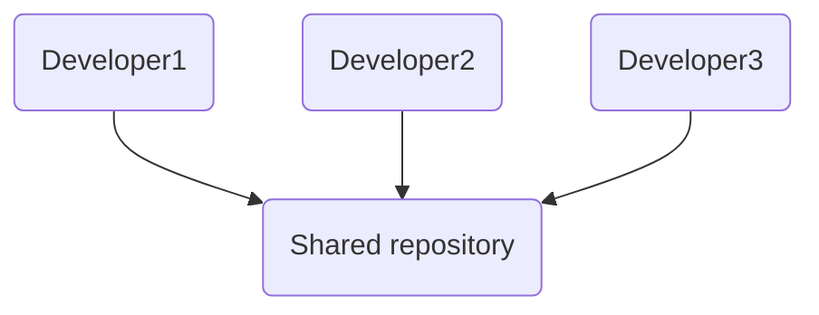
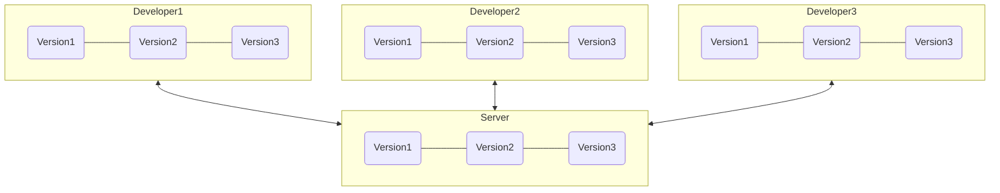
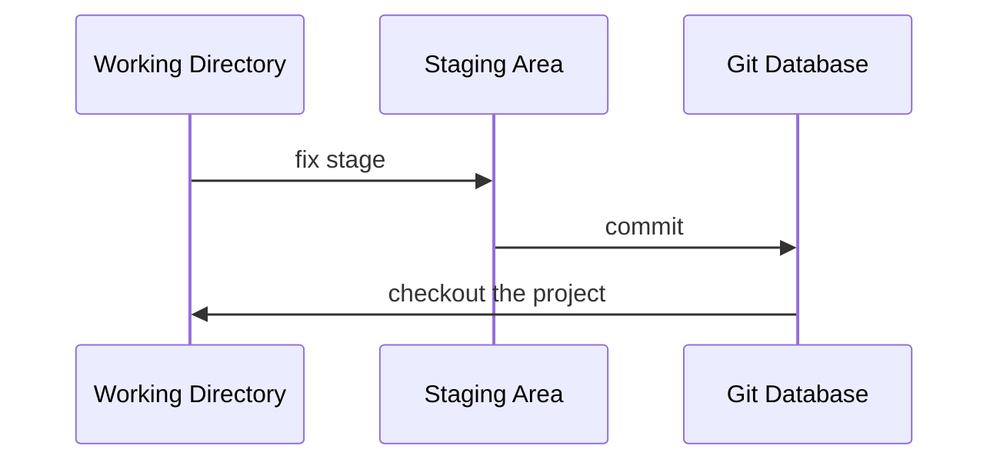
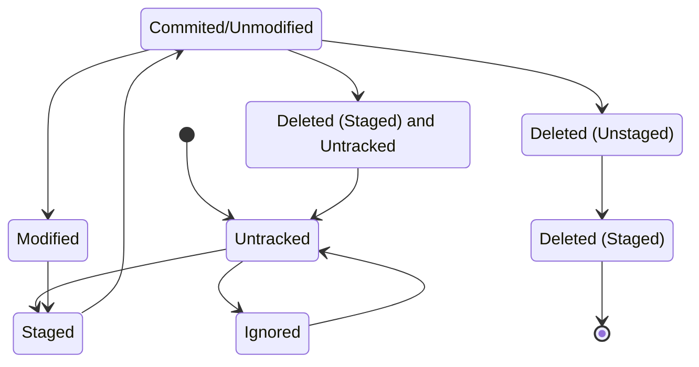
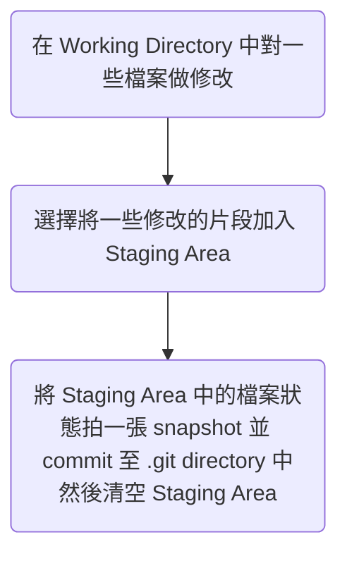

ㄆ# 學習資源

- [官方文件](https://git-scm.com/docs)
- <https://www.youtube.com/watch?v=Uszj_k0DGsg>

# 常用術語

這裡先列舉幾個常用的術語，並附上簡單的解釋，後續的篇章中首次提到某個名詞時會再詳細解釋該名詞的意思。

|Terms|Description|
|---|---|
|repository (repo)|一個版本控制系統所控制的最大單位，repo 中可能有 sub-repo|
|commit|將檔案的最新狀態「提交」給 Git|
|working directory|「目前」你看到的 repo 狀態|
|staging area|「準備」被 commit 的 repo 狀態|
|branch|分支，如同歷史中某個時間點分裂出來的平行時空，一個 branch 是由一串線性的 commits 組成|
|checkout|「切換」所在的 branch|
|reset|「切換」所在的 commit，勿與 checkout 搞混|
|merge|(branches 的) 合併，在兩個平行時空的檔案狀態中找出一個共識並合而為一|
|conflict|(檔案內容的) 衝突，一個檔案在兩個 branches 中的內容不一致，有 conflict 就要解|
|difference (diff)|(檔案內容的) 差異，一個檔案在兩個 commits 間的內容不一致，勿與 confict 搞混|
|cherry pick|把別的 branch 合併進自己時，只挑選部分 commit 合併，其餘採用自己的版本|
|local|本地，也就是 repo 擁有者的電腦本機|
|remote|遠端（或雲端）託管平台，各個參與者可以向 remote 索取或推送 repo|
|push|將 repo 從 local 推送到 remote|
|fetch|向 remote 索取 repo 至 local|
|clone|將 repo 的所有內容以及所有歷史版本都從 remote 複製一份到 local|

# Version Control Systems

Git 是一個 Version Control Systems (VCSs, 版本控制系統)，VCSs 可以分為集中式 (Centralized) 與分散式 (Distributed)：

### Centralized VCSs (CVCSs)

所謂的 Centralized，就是把檔案的所有版本存放在單一 server 的資料庫裡統一管理，clients (developers) 向這台 server 索取或存放特定的版本：



其中一個有名的 CVCS 叫做 Subversion (SVN)。

**CVCSs 的缺點**

- Single Point of Failure。

### Distributed VCSs (DVCSs)

DVCSs 重點在於「所有 clients 都可以擁有完整的檔案歷史」，換句話說，每個 clients 的 local 都有一個記錄所有歷史的資料庫：



Git 即屬於 DVCS。

**DVCSs 的優點**

- 由於每個參與者的 local 都可以有完整的歷史，因此有越多人參與，檔案歷史被有心人士「完全」篡改的難度就越高
- 由於每個參與者的 local 都可以有完整的歷史，因此不用連上網就可以進行幾乎所有版本管理的操作

# Git

### Git 與 Linux Kernal

Git 的發明者同時也是 Linux kernal 的發明者：Linus Torvalds。Git 本來只是 Linus 在開發 Linux kernal 時，因為覺得當時既有的 VCS 太難用而開發的替代品（聽說他只花了 10 天…），後來逐漸被社群所接納。

### Git 與其他 VCS 最大的不同

多數 VCSs 通常是透過紀錄「每次的檔案變動 (differences)」來管理一個檔案的不同版本，但 Git 是透過「快照 (snapshot)」的方式來紀錄一個檔案每次被變更並提交 (commit) 後的樣子。

### Git 如何確保 Data Integrity?

Git 每次儲存一個版本前，都會使用 SHA-1 演算法為這個版本計算出一個 hash value（動作稱為 **checksum**），計算的對象是這個版本的 repository 中的「所有檔案的內容」，這個 hash value 是由 40 個 16 進制字元組成的字串，形如：

```plaintext
24b9da6552252987aa493b52f8696cd6d3b00373
```

只要任何檔案的內容有任何改動，checksum 的結果幾乎都會不一樣，發生 collision（不同檔案內容計算出相同 hash value）的機率極低。

### `.git` Directory

所有版本控制相關的資訊皆存放在 `.git` 這個 directory 裡，包括所有的 commits、branches… 等，所以==如果 `.git` 被刪了，所有歷史就都消失了==，關於 `.git` directory 的更多細節，請見 [[CH3 - 開始使用 Git#`.git` Directory|本文]]。

### 📌 檔案在 Git 裡的狀態

一個檔案若存在於一個有用 Git 做版控的 repository 中，但沒有被納入管轄，則該檔案的狀態為 **Untracked**，「新增」的檔案以及「在 apply Git 之前就存在」的檔案，其狀態會是 Untracked。

可以在一個叫做 `.gitignore` 的檔案中特別聲明要 Git 忽略某些檔案的變更，此時我們可以說該檔案的狀態為 **Ignored**，關於 `.gitignore` 的詳情，請見 [[CH3 - 開始使用 Git#`.gitignore` File|本文]]。

而一個「已被納入 Git 版控」的檔案有四種可能的狀態，分別是：**Modified**, **Staged**, **Committed** 以及 **Deleted**

- **Modified**

    一個檔案的內容與最近一次的 commit 中的==內容不一致==，也==還沒被「認可」==為可以被提交成為最新的版本。

- **Staged**

    一個檔案的內容與最近一次的 commit 中的==內容不一致==，但==已經被認可==，準備被 commit 為最新版本。

    一個檔案「首次」被納入 Git 版控，且處於 staged 狀態時，這個狀態會被另外標記為 **NewFile**。

    一個檔案可能有部分內容為 modified，部分為 staged，而所謂的 **Staging Area** 就是所有 staged 的檔案內容，Staging Area 裡的檔案狀態也被存在 `.git` 裡。

- **Committed**

    一個檔案的內容與最近一次的 commit 中的==內容完全一致==，這個狀態有時候又被叫做 **Unmodified**。

- **Deleted**

    以下兩種狀態都算是 Deleted：

    1. **Deleted (Unstaged)**

        某檔案在最近一次的 commit 中存在，但卻不存在於現在的 Working Directory，這個「消失的狀態」也還沒被「認可」。

    2. **Deleted (Staged)**

        Staging area 顯示某檔案「脫離 Git 管控」，時機有以下兩種：

        - 第一點所述的「消失的狀態」被「認可」後
        - 檔案沒有被實際刪除，但使用者主動讓 repo 中的某檔案「脫離 Git 管控」時，==這個狀態下的檔案同時會是 Untracked==

---

下圖為 Working Directory, Staging Area 與 Git Database 之間的關係：



從檔案的角度出發，則可以用下面這張 Finite State Machine 表示：



### 使用 Git 的基本 Wrokflow

現在假設已經有一個使用 Git 的 repo，那麼一個基本的 workflow 會像是這樣：



# GitHub

別把 Git 與 GitHub 搞混了，Git 是一個 VCS，而 GitHub 是一個網站，這個網站提供的主要服務是一個 Git Server，也就是前面在 [[#常用術語]] 提到的 **remote** 的一種，其他提供類似服務的網站包括 GitLab, Bitbucket, GitKraken… 等。其他關於 GitHub 的細節請見[[GitHub|本文]]。
