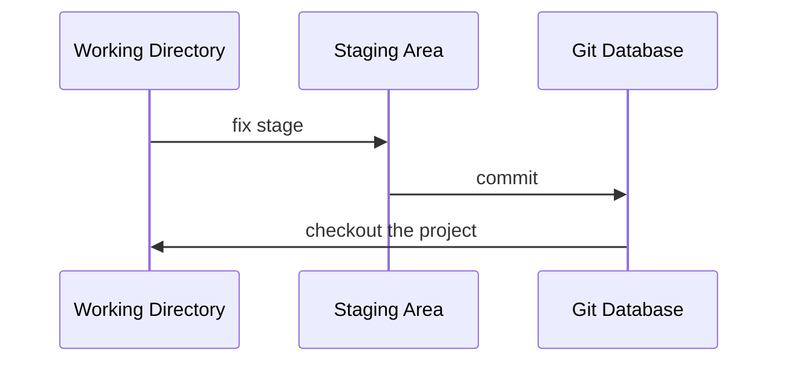
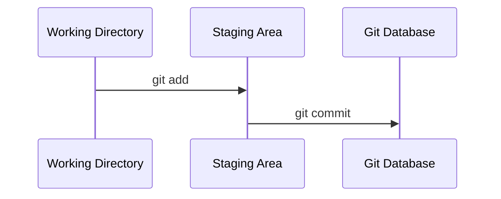

# Initialization

無論是已經行之有年的專案，或者是剛建立的專案，Git 隨時可以被導入其中，要讓一個專案被 Git 管控，就必須在該專案的根目錄執行以下指令：

```bash
git init
```

執行這個指令後，你會發現專案根目錄多了一個叫做 `.git` 的 directory，且裡面已經有一些 sub-directories 與 files，`.git` directory 就是未來用來進行這個專案的所有有關本控制的動作時會用到的唯一 directory，裡面包含了版本控制資料庫、local 設定檔… 等，稍後將逐一介紹。

# Your First Commit

在 [[CH1 - 簡介#📌 檔案在 Git 裡的狀態|CH1]] 有提到檔案在 Git 裡的各種狀態，讓我們回顧一下這張圖：



現在就讓我們一步一步來了解要如何使用指令把一個檔案從 Working Directory 放到 Staging Area，再從 Staging Area 正式提交到 Git Database 吧！

### Working Directory $\rightarrow$ Staging Area

使用 `git add` 指令可以將 working directory 中（狀態為 Untracked、Modified 或者 Deleted）的檔案搬移到 staging area（使其狀態變成 Staged），command pattern 如下：

```bash
git add <FILE1> [<FILE2> ...]
```

也可以使用 `--all` option 一次將「所有」狀態為 Untracked、Modified 以及 Deleted 的檔案搬移到 staging area：

```bash
git add --all
# or
git add .
``` 

其實 ==`git add .` 的效果不完全等於 `git add --all`==，有兩點須要注意：

1. 因為 `.` 指的是「目前所處的目錄的所有檔案」，因此如果不是在專案根目錄執行 `git add .`，就只會把執行指令時所處的 sub-directory 中的檔案放進 staging area；但 `git add --all` 無論如何都會把 repo 中所有狀態有變更的檔案放進 Staging Area

2. 在 Git 1.x 中，`git add .` 並不會把狀態為 Deleted (Unstaged) 的檔案加進 staging area，但 `git add --all` 會

>[!Warning]
>請謹慎使用 `git add --all` 以及 `git add .`，因為 Staging Area 是變動進入 Git Database 前的最後一道防線，你必須很清楚自己允許了哪些東西進入 Staging Area。

### Staging Area $\rightarrow$ Git Database

使用 `git commit` 指令可以將 staging area 中的檔案正式提交到 Git database，使其狀態變為 Commited/Unmodified，commit 時必須附註 message，command pattern 如下：

```bash
git commit [-m "<YOUR_MESSAGE>"]
```

commit message 有內容長度限制，且有 title 與 description 之分，若你想輸入的 commit message 並不像上方指令一樣可以一行解決，那輸入指令時就先不要輸入 `-m` option 以及後面的 message（輸入 `git commit` 即可），如此一來，Git 就會[[CH2 - 安裝與設定#設定編輯器|打開一個文字編輯器]]，讓你更有彈性地編輯 commit message，關於 commit message 格式的詳細敘述，請見 [[Commit Message|本文]]。

**一步完成 `git add` 與 `git commit`**

```bash
git commit -a -m "my message"
```

上面這個指令會「近似於」`git add --all` + `git commit -m "my message"`，只有「近似」的原因是因為 `-a` option 只會把狀態為 modified 與 deleted 的檔案加進 staging area，untracked 的檔案不會被加進去。

**提交一個 Empty Commit**

一般情況下，Staging Area 裡沒有東西就不能 commit，但若在 `git commit` 指令後方加上 `--allow-empty` option，就可以提交空的 staging area，產生一個不包含任何變動的 commit。

---

有了 `git add` 以及 `git commit` 這兩個指令，我們可以把上方流程圖的部分動作用指令代替：



---

### 查看目前 Repo 的狀態

```bash
git status
```

這個指令不只會 output 目前 repo 的狀態，還會提示你應該做什麼動作，像是這樣：

```plaintext
On branch main
Changes not staged for commit:
  (use "git add <file>..." to update what will be committed)
  (use "git restore <file>..." to discard changes in working directory)
        modified:   .gitignore

Untracked files:
  (use "git add <file>..." to include in what will be committed)
        test1

no changes added to commit (use "git add" and/or "git commit -a")
```

或是這樣：

```plaintext
On branch main
nothing to commit, working tree clean
```

如果只是想大概看一下目前的狀態，也可以加上 `--short` (`-s`) 讓 output 精簡一點，通常建議也搭配 `--branch` (`-b`) 使用：

```bash
git status -sb
```

Output:

```plaittext
## main
 M test1
```

### 查看過往的 Commits

```bash
git log
```

Output:

```plaintext
commit d26358f4984d3bfab006a341788e61468c44dc10
Author: Jamison-Chen <jamison.chen@pinkoi.com>
Date:   Tue May 23 09:28:59 2023 +0800

    I add a new file, cool

commit d400b1af48a94d7a7ecdfda175193a4d5816673b
Author: Jamison-Chen <jamison.chen@pinkoi.com>
Date:   Tue May 23 09:27:47 2023 +0800

    this is my first commit
```

可以加上 `--oneline` option 讓 log 看起來簡潔乾淨一點：

```bash
git log --oneline
```

Output:

```plaintext
d26358f (HEAD -> main) I add a new file, cool
d400b1a this is my first commit
```

之後開始用到 branch 後，`--oneline` 搭配 `--graph` option 就可以 stdout 類似 graph 的 log：

```bash
git log --oneline --graph
```

Output:

```plaintext
* b781873c63e (HEAD -> after_paid_noti) add new cf ids
* 8ec1691658e Asia Fest seller coupons (#13648)
* fd87058ca06 adjust test& black format
*   cb6d870fb5b Merge branch 'dev'
|\  
| *   35c6e861f68 Merge branch 'dev'
| |\  
| * | c594e1b98ba add comment for HACK
* | | 22550f89f48 Fix test_listing_keyword_suggestion
| |/  
|/|   
* |   45527e60417 Merge branch 'upsert_payment_request_log' into dev
.
.
.
```

# `.git` Directory

在 [[CH1 - 簡介#常用術語|CH1 進行常用名詞的解釋]]時寫：「repo 是一個版本控制系統所控制的最大單位」，不過其實幾乎可以說 `.git` directory 才是所謂的 repo，一個 repo 就對應到一個 `.git`，`.git` 是 Git 用來達成版本控制的唯一 directory。

### 如何使專案脫離 Git 管控？

由於 `.git` 是 Git 用來達成版本控制的唯一 directory，因此若要使專案脫離 Git 管控，就直接==將 `.git` 整包刪除==即可！

須注意的是，一旦將 `.git` 刪掉就意味著關於此專案所有的歷史版本都會遭到刪除，只剩下刪除當下的 working directory 這個版本，如果刪掉 `.git` 後你後悔了，想要把它救回來，唯一的指望就是從 remote repo 或者別人的 local repo 拿了。

# `.gitignore` File

#TODO 
