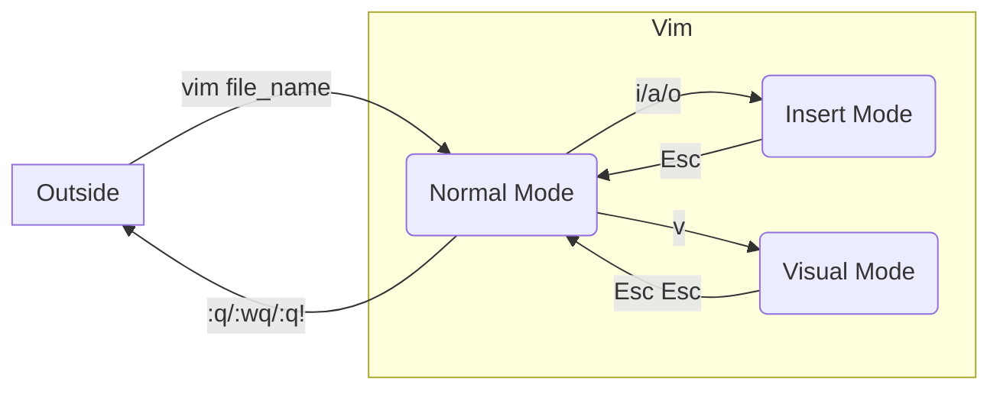

# 使用 Vim 開啟檔案

```bash
vim <file_name>
```

若輸入的檔案名稱不存在，則會先自動新增該檔案再進入 Vim。

# Modes



### 三種進入 Insert Mode 的方式

- `i`: cursor 會初始化在 Normal Mode 時 cursor 出現的地方
- `a`: cursor 會初始化在 Normal Mode 時 cursor 出現的地方的下一個字元
- `o`: 在 Normal Mode 時 cursor 出現的地方所屬的 line 之下==插入新的一行==

### 常用的 Normal Mode 指令

- `yy`：複製目前 cursor 所處的整行
- `p`：貼上
- `u`：undo
- `control R`：redo
- `x`：向後刪除一個字元
- `dd`：可以刪除目前 cursor 所在的整行
- `:` + 數字 (n)：跳到第 n 行
- 數字 (n) + 指令：連續執行該指令 n 次

    e.g. `5u` 代表連續做五次 undo，`3dd` 代表刪除三行

- 輸入 `/` + 「想查詢的字詞」然後按 `Enter`：搜尋離 cursor 最近且比 cursor 後面的該字詞

### Visual Mode for Selecting

在 Visual Mode 中可以透過上下左右鍵更改選取範圍，`x` 是剪下選取範圍，`y` 是複製選取範圍，`p` 是貼上選取範圍，`d` 是刪除選取範圍。

# 離開 Vim

離開 Vim 時，若有對檔案做改動，則須聲明是否要寫入（儲存）這些改動：

- `:wq`: 寫入（儲存）改動並離開 Vim
- `:q!`: 不寫入並離開

若沒有改動則可以 `:q` 直接離開 Vim；若只是要存檔沒有要離開 Vim，則應輸入 `:w`。

# 設定與設定檔

### 常見設定

在 Normal Mode 下輸入以下指令可以設定你的 vim 編輯器：

- `:set nu` 或 `:set number`: 顯示行號

- `:set relativenumber`

    顯示目前游標所在的真實行號，其他行顯示相對於游標所在行的距離（此設定使得「數字 + 方向鍵」移動游標變得較直覺）

- `:set tabstop=<n>`: 設定一個 `\t` 代表幾個空白
- `:set shiftwidth=<n>`: 設定一個 indent 代表幾個空白
- `:set autoindent`: 換行時根據前一行是否有 indent 來決定新行的開頭是否要有 indent
- `:set mouse=a`: 允許使用滑鼠點擊、滾動

### `.vimrc` 設定檔

在 Vim 編輯器中輸入的設定於本次離開 Vim 後就會消失。但是可以在 home directory (`~`) 可以建立一個叫做 `.vimrc` 的檔案，然後將設定寫在裡面，這樣以後打開 Vim 時都會先載入這個設定檔中的設定，須注意的是，設定檔中的設定不需要以 `:` 開頭，範例設定檔如下：

```plaintext
set nu
set relativenumber
set tabstop
set shiftwidth
set autoindent
set mouse=a
```

# 參考資料

- <https://www.youtube.com/watch?v=RZ4p-saaQkc>
- [Vim Cheat Sheet](https://hackmd.io/@sysprog/gnu-linux-dev/https%3A%2F%2Fvim.rtorr.com%2F)
