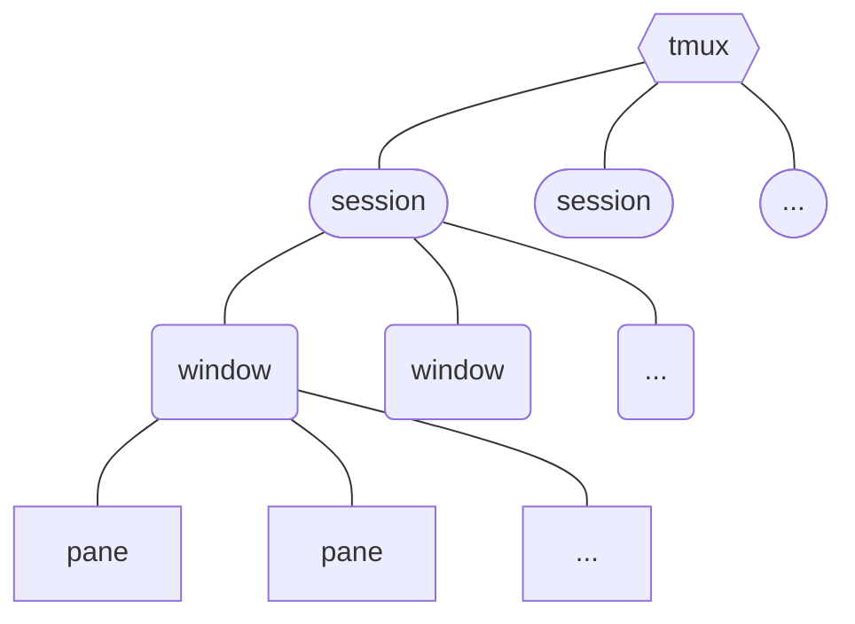

# Introduction

tmux 是一個結合了 terminal、session management 與 window management 的工具，這種工具被泛稱為 **terminal multiplexer**。

使用 tmux，你可以開啟多個 sessions 並讓 terminal 連上任意的 session，一個 session 底下可以開啟多個 windows，一個 window 底下可以開啟多個 panes：




# 安裝

### Linux

- Ubuntu Linux

    ```bash
    sudo apt-get install tmux
    ```

- CentOS Linux

    ```bash
    sudo yum install tmux
    ```

### MacOS

```bash
brew install tmux
```

# 進入 tmux 指令模式

在 tmux 中若要下 tmux 的專屬指令，則必須先進入指令模式，進入指令模式的方式為 `Control` + `B`。後續將逐一介紹各個 tmux 指令。

# Session Management

### 建立 Session

```bash
tmux
```

每個 session 都會有名稱，使用此方法建立的 session 其名稱為流水號，也可以使用下面這個指令在建立一個 tmux session 時指定該 session 的名稱：

```bash
tmux new -s <SESSION_NAME>
```

### Nested Session

有些人可能會誤以為所謂的「建立多個 sessions」就是在一個 tmux session (S1) 中再下一次 `tmux` 指令來建立 tmux session (S2)，不過其實這麼做所建立出來的 session S2 叫做 nested session，通常不會有人這麼做，所以當你這麼做時，tmux 會跳出警告，並要求你改為輸入 `$TMUX` 來建立 nested session。

真正建立多個 tmux sessions 的方法是建立一個 session 後，先與該 session 分開 (detach)，回到原生的終端機畫面後再建立新的 session，因此我們必須先瞭解如何 detach：

### Detach with a Session

Detach 某個 session 的方法有兩種：

- 使用 tmux 指令：先 `Control` + `B` 進入指令模式，然後輸入 `D`
- 直接把 terminal 關掉（close 或 quit 都可以）

### Attach with a Session

```bash
tmux attach -t <SESSION_NAME>

# or

tmux a -t <SESSION_NAME>
```

Detach 某個 session 後，該 session 仍會在背景運行（原本執行中的指令會繼續執行）比如若你在一個 tmux session 中安裝一個 package，安裝到一半時誤將 terminal 關掉了，此時安裝流程其實並不會被中斷，因此當你重新打開 terminal 並重新 attach 剛才的 session 後就一切正常了。

### 列出所有 Sessions

```bash
tmux ls
```

這個指令可以在 tmux session 中下，也可以在 tmux session 外下。

### 刪除 Session

```bash
tmux kill-session -t <SESSION_NAME>
```

若在某個 tmux session 中刪除當前 session，則會被踢出 session，回到原生 terminal。

- 刪除所有 Sessions

    ```bash
    tmux kill-session -a
    ```

    若在某個 tmux session 中刪除所有 sessions，則當前所處之 session 不會被刪除。

### 重新命名 Session

```bash
tmux rename-session -t <OLD_NAME> <NEW_NAME>
```

# Windows & Panes

在一個 session 中開啟多個 windows 就很像在 VS Code 中開啟多個 tabs，每一個 tabs 都會佔滿整個畫面；在一個 window 中開啟多個 panes 則有如在 VS Code 中進行分割畫面，你可以在一個畫面看到多個終端機。

### 使用 tmux 管理 Windows & Panes

>[!Note]
>輸入以下介紹的指令前，皆須先輸入 `Control` + `B` 以進入指令模式。

- `C`：新增 window
- `W`：列出所有 windows
- `&`：刪除 window
- `%`：垂直分割目前的 window 為左右兩個 panes
- `"`：水平分割目前的 window 為上下兩個 panes
- `<方向鍵>`：切換 panes
- `P`：切換至前一個 window
- `N`：切換至下一個 window
- `<N>`：切換至第 N 個 window
- `X`：關閉當前 pane

# 參考資料

- <https://www.hamvocke.com/blog/a-quick-and-easy-guide-to-tmux/>
- <https://andyyou.github.io/2017/11/27/tmux-notes/>
